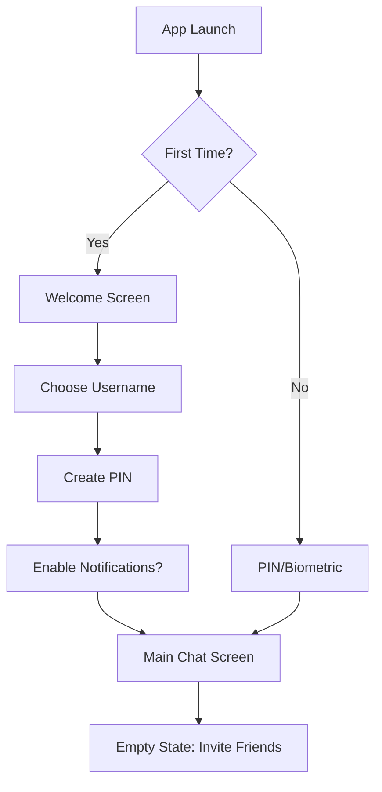

# Streamlined Onboarding Flow

## Design Philosophy
**"Every second counts"** - Get users into the app and chatting within 30 seconds.

## Flow Diagram



## Screen-by-Screen Design

### Screen 1: Welcome
```
┌─────────────────────────┐
│                         │
│         Volly          │
│                         │
│    [Volly Logo/Icon]    │
│                         │
│  "Private messaging     │
│   made simple"          │
│                         │
│                         │
│  ┌───────────────────┐  │
│  │   Get Started     │  │
│  └───────────────────┘  │
│                         │
│  Already have account?  │
│      [Restore]          │
└─────────────────────────┘
```

**Details:**
- Clean, minimal design
- Single CTA button
- Subtle restore option for existing users
- No technical jargon

### Screen 2: Choose Username
```
┌─────────────────────────┐
│ ←                       │
│                         │
│   What should we        │
│   call you?             │
│                         │
│  ┌───────────────────┐  │
│  │ Your name         │  │
│  └───────────────────┘  │
│                         │
│  This is how friends    │
│  will find you          │
│                         │
│                         │
│                         │
│  ┌───────────────────┐  │
│  │    Continue →     │  │
│  └───────────────────┘  │
└─────────────────────────┘
```

**Details:**
- Auto-focus on input field
- Real-time availability check
- Friendly suggestions if taken
- No email/phone required

### Screen 3: Security PIN
```
┌─────────────────────────┐
│ ←                       │
│                         │
│   Create a PIN          │
│                         │
│     ● ● ● ● ● ●         │
│                         │
│   ┌───┬───┬───┐         │
│   │ 1 │ 2 │ 3 │         │
│   ├───┼───┼───┤         │
│   │ 4 │ 5 │ 6 │         │
│   ├───┼───┼───┤         │
│   │ 7 │ 8 │ 9 │         │
│   ├───┼───┼───┤         │
│   │   │ 0 │ ← │         │
│   └───┴───┴───┘         │
│                         │
│  You'll use this to     │
│  unlock Volly           │
└─────────────────────────┘
```

**Details:**
- 6-digit PIN (not password)
- Large touch targets
- No complexity requirements
- Option for biometric later

### Screen 4: Permissions (Optional)
```
┌─────────────────────────┐
│                         │
│   Enable notifications? │
│                         │
│    [Bell Icon]          │
│                         │
│  Get notified when      │
│  friends message you    │
│                         │
│  ┌───────────────────┐  │
│  │   Yes, Enable     │  │
│  └───────────────────┘  │
│                         │
│      Maybe Later        │
│                         │
└─────────────────────────┘
```

**Details:**
- Skippable
- Clear value proposition
- Can enable later in settings
- No other permissions needed yet

### Screen 5: Success!
```
┌─────────────────────────┐
│                         │
│        ✓                │
│                         │
│   You're all set!       │
│                         │
│   Your messages are     │
│   always encrypted      │
│                         │
│  ┌───────────────────┐  │
│  │  Start Chatting   │  │
│  └───────────────────┘  │
│                         │
└─────────────────────────┘

Transition (1.5s) →

┌─────────────────────────┐
│ Chats          + 🔍 ⚙️  │
├─────────────────────────┤
│                         │
│   No chats yet          │
│                         │
│   [Illustration]        │
│                         │
│   Invite friends to     │
│   start chatting        │
│                         │
│  ┌───────────────────┐  │
│  │  Invite Friends   │  │
│  └───────────────────┘  │
│                         │
│  ┌───────────────────┐  │
│  │   Add Username    │  │
│  └───────────────────┘  │
│                         │
└─────────────────────────┘
```

## Onboarding Variations

### Returning User
```
┌─────────────────────────┐
│                         │
│       Welcome back      │
│                         │
│    [Fingerprint Icon]   │
│                         │
│   Touch ID to unlock    │
│                         │
│      or use PIN         │
│                         │
└─────────────────────────┘
```

### Invited User
When clicking an invite link:
```
┌─────────────────────────┐
│                         │
│   Alice invited you     │
│   to Volly             │
│                         │
│   [Alice's Avatar]      │
│                         │
│  ┌───────────────────┐  │
│  │   Join & Chat     │  │
│  └───────────────────┘  │
│                         │
└─────────────────────────┘
```
→ Skip to username selection
→ Auto-add Alice as contact
→ Open chat with Alice

## Smart Defaults & Hidden Complexity

### What Users See:
- Choose name
- Create PIN
- Start chatting

### What Happens Behind Scenes:
```javascript
// On "Get Started"
1. Generate Ed25519/X25519 keypair
2. Create IndexedDB encrypted vault
3. Initialize secure storage

// On Username Selection
4. Connect to signaling server
5. Register username
6. Set up WebRTC listeners

// On PIN Creation
7. Derive key with Argon2id
8. Encrypt vault with derived key
9. Store encrypted identity

// On Completion
10. Initialize P2P networking
11. Set up message queuing
12. Start heartbeat/keepalive
```

## Progressive Feature Introduction

### Day 1: Core Features Only
- Text messaging
- Add contacts
- Basic settings

### Day 3: Gentle Nudge
```
"Did you know you can send voice messages? 
Just hold the microphone button!"
```

### Week 1: Advanced Features
```
"Your chats work even offline! 
Messages will send when you reconnect."
```

### Week 2: Power Features
```
"Want more privacy? Try 'Airplane Mode' 
to chat without any servers!"
```

## Error Handling

### Username Taken
```
"That name is taken. How about:
• [Name]123
• [Name]_
• The_Real_[Name]"
```

### Connection Issues
```
"Can't connect right now. 
We'll keep trying!"
[Retry] [Work Offline]
```

### PIN Forgotten
```
"Forgot your PIN?"
[Reset Account] - Warning: This will delete your messages
[Contact Support]
```

## Accessibility Features

- **VoiceOver/TalkBack** support on all screens
- **High contrast mode** detection
- **Reduced motion** respects system settings
- **Large text** scales properly
- **Keyboard navigation** fully supported

## A/B Testing Opportunities

### Test 1: PIN vs Password
- A: 6-digit PIN (current)
- B: Simple password
- Measure: Completion rate, security

### Test 2: Username Selection
- A: Required upfront
- B: Optional (generate random)
- Measure: Friction, user preference

### Test 3: Invite Flow
- A: After onboarding
- B: During onboarding
- Measure: First message time

## Success Metrics

### Target Goals:
- **Completion Rate:** >95%
- **Time to Complete:** <30 seconds
- **Time to First Message:** <2 minutes
- **Drop-off Rate:** <5% per screen
- **Error Rate:** <1%

### Tracking Points:
1. Screen view duration
2. Tap/interaction count
3. Error occurrences
4. Back button usage
5. Success completion

## Implementation Notes

### React/Svelte Components Needed:
```
- OnboardingFlow.svelte
- WelcomeScreen.svelte
- UsernameInput.svelte
- PINInput.svelte
- PermissionRequest.svelte
- EmptyState.svelte
```

### State Management:
```javascript
onboardingStore = {
  step: 'welcome',
  username: '',
  pin: '',
  permissions: {
    notifications: null
  },
  identity: null,
  error: null
}
```

### Animations:
- Smooth transitions between screens
- Success checkmark animation
- Loading states during async operations
- Subtle micro-interactions

## Post-Onboarding Experience

### First Actions:
1. **Invite Friends** - Share link
2. **Add Username** - Find friends
3. **Explore** - Discover features

### Contextual Education:
- Tooltips on first use
- Feature discovery prompts
- Success celebrations
- Non-intrusive hints

The goal is to make users feel accomplished and excited to use Volly, not overwhelmed by choices or confused by technical concepts.