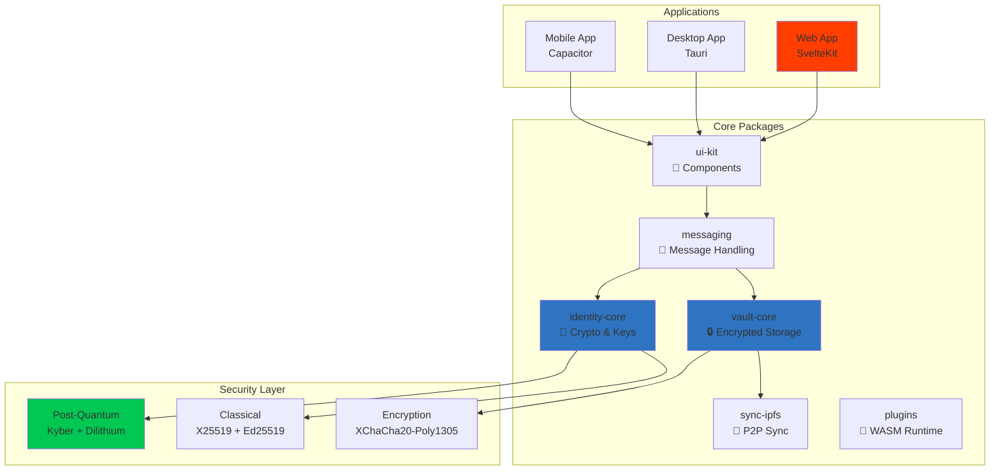

<div align="center">


# Intelligent Privacy, User Sovereignty, Local‑First Messaging

<p align="center">
  <a href="LICENSE"></a>
  <a href="https://www.typescriptlang.org/"></a>
  <a href="https://kit.svelte.dev/"></a>
  <a href="#"></a>
  <a href="docs/SECURITY.md"></a>
</p>

<h3>The only messenger that adapts to you—not the other way around.</h3>

<br/>

</div>

> [!NOTE]
> **Project Status: 🚀 Alpha - Building Intelligent Privacy**  
> Working encrypted messenger with P2P communication, persistent storage, and real crypto. Now developing the Adaptive Trust System—intelligent privacy that adapts to your context while respecting your absolute control.

> [!TIP]
> **Current Focus**: Adaptive Trust System implementation. This groundbreaking feature balances privacy and performance automatically, learning from your usage patterns while keeping all data local. Your sovereignty rules always override system suggestions.

> [!IMPORTANT]
> **Want to Contribute?** Check out our [Task Board](docs/TASK_BOARD.md) to find available work!

## 💡 Why Privacy Shouldn't Be Hard

> **The Problem**: Every messaging app makes you choose—either sacrifice privacy for features, or sacrifice usability for security.
> 
> **Our Solution**: Volli's Adaptive Trust System intelligently adjusts security based on your context, while your sovereignty rules ensure you're always in control. No more all-or-nothing privacy.

<br/>

## 🌟 Why Choose Volli?

<table>
<thead>
<tr>
<th width="300">Feature</th>
<th width="200" align="center">Volli</th>
<th width="200" align="center">Signal/WhatsApp</th>
</tr>
</thead>
<tbody>
<tr>
<td><strong>🔮 Post‑Quantum Crypto</strong></td>
<td align="center">🚧 Planned</td>
<td align="center">❌ Not Yet</td>
</tr>
<tr>
<td><strong>💾 Local‑First Storage</strong></td>
<td align="center">✅ IndexedDB Encrypted</td>
<td align="center">❌ Server Required</td>
</tr>
<tr>
<td><strong>🌐 Offline Operation</strong></td>
<td align="center">✅ Fully Offline</td>
<td align="center">❌ Limited</td>
</tr>
<tr>
<td><strong>🧩 Plugin Ecosystem</strong></td>
<td align="center">✅ WASM Runtime Ready</td>
<td align="center">❌ None</td>
</tr>
<tr>
<td><strong>🔗 P2P Messaging</strong></td>
<td align="center">✅ WebRTC P2P</td>
<td align="center">❌ Centralized</td>
</tr>
<tr>
<td><strong>🎯 Adaptive Trust</strong></td>
<td align="center">🚧 In Development</td>
<td align="center">❌ None</td>
</tr>
<tr>
<td><strong>👑 User Sovereignty</strong></td>
<td align="center">✅ Your Rules First</td>
<td align="center">❌ Platform Rules</td>
</tr>
</tbody>
</table>

> [!IMPORTANT]
> **Your privacy, your rules, your device—no exceptions, no compromises.**

### 🎯 The Volli Difference: Intelligent Privacy

Unlike other messengers that force you to choose between privacy and convenience, Volli adapts intelligently to your context:

- **☕ Convenience Mode**: For casual chats on trusted networks (< 2% battery)
- **🛡️ Balanced Mode**: Smart defaults for daily use (< 4% battery)  
- **🏰 Private Mode**: Maximum security for sensitive content (< 6% battery)
- **🔒 Air Gap Mode**: Complete offline operation when you need it

**Your Sovereignty**: Set rules once, and Volli respects them forever. No AI profiling, no cloud analytics—just intelligent local processing that puts you in control.

<br/>

## 🚀 Quick Start

> [!SUCCESS]
> **P2P Messaging Working**: Connect directly to peers using WebRTC data channels. Messages are encrypted, queued when offline, and synced in real-time. Your data persists locally in encrypted IndexedDB storage.

> [!TIP]
> Volli uses **P2P connections**—messages go directly between peers via WebRTC. No servers store your messages. Currently requires manual connection (offer/answer exchange) until signaling server is added.

<details open>
<summary><h3>📦 Installation</h3></summary>

```bash
# Clone the repository
git clone https://github.com/foofork/Volli.git
cd Volli

# Install dependencies
npm install

# Build packages
npm run build:packages

# Run the web app
cd apps/web && npm run dev     # → http://localhost:3000

# Run tests (89.7% coverage)
npm test
```

</details>

<details>
<summary><h3>🖥️ Platform-Specific Builds</h3></summary>

#### Desktop (Tauri)
```bash
# Requires Rust toolchain
cd apps/desktop && npm run dev
```

#### Mobile (Capacitor)
```bash
# Requires Xcode/Android Studio
cd apps/mobile && npm run dev
```

</details>

<br/>

## ✨ Features

### 🎯 What's Actually Working

- [x] **📦 Core Packages** - Encryption libraries with real crypto implementations
- [x] **🧪 Test Coverage** - 89.7% coverage (113/126 tests passing)
- [x] **🎨 Web UI** - Full functionality with all screens working
- [x] **💾 Persistent Storage** - IndexedDB with Dexie, encrypted vault
- [x] **🔑 Vault System** - Create, unlock, auto-lock with Argon2id KDF
- [x] **💬 P2P Messaging** - WebRTC data channels for direct peer communication
- [x] **📨 Message Queue** - Persistent queue with exponential backoff retry
- [x] **🔐 Recipient Encryption** - Per-recipient message encryption
- [x] **🧩 Plugin System** - WASM runtime with sandboxing
- [ ] **🔐 Post-Quantum Crypto** - Not yet implemented
- [ ] **📡 Signaling Server** - Manual peer connection required

### 🚧 In Active Development (Phase 2)

- [x] **🎯 Adaptive Trust System** - Architecture complete, implementation started
  - [x] Research & design documentation complete
  - [x] API contracts and architecture defined
  - [ ] Core implementation (current focus)
  - [ ] UI integration and trust visualization
- [ ] **📡 Signaling Server** - Automatic peer discovery
- [ ] **🔄 CRDT Sync** - Conflict resolution for multi-device
- [ ] **📁 File Sharing** - Encrypted file transfer
- [ ] **🔮 Post-Quantum Crypto** - Kyber-1024 + Dilithium-3
- [ ] **🖥️ Desktop App** - Native Tauri application
- [ ] **📱 Mobile Apps** - iOS and Android with Capacitor
- [ ] **👥 Group Chat** - Multi-participant conversations

<br/>

## 🏗️ Architecture



> [!NOTE]
> See [Architecture Documentation](docs/ARCHITECTURE.md) for detailed system design.

<br/>

## 🔒 Security Overview

<table>
<thead>
<tr>
<th>Layer</th>
<th>Technology</th>
<th>Purpose</th>
</tr>
</thead>
<tbody>
<tr>
<td><strong>🔐 Encryption</strong></td>
<td>XChaCha20-Poly1305</td>
<td>Message & storage encryption</td>
</tr>
<tr>
<td><strong>🔑 Key Exchange</strong></td>
<td>X25519</td>
<td>ECDH key agreement</td>
</tr>
<tr>
<td><strong>✍️ Signatures</strong></td>
<td>Ed25519</td>
<td>Authentication & integrity</td>
</tr>
<tr>
<td><strong>🔑 KDF</strong></td>
<td>Argon2id</td>
<td>Password-based key derivation</td>
</tr>
<tr>
<td><strong>💾 Storage</strong></td>
<td>IndexedDB (Dexie)</td>
<td>Encrypted local persistence</td>
</tr>
<tr>
<td><strong>🌐 Network</strong></td>
<td>WebRTC P2P</td>
<td>Direct peer connections</td>
</tr>
</tbody>
</table>

> [!CAUTION]
> **Alpha Software**: P2P messaging works but requires manual connection setup. Not audited for production use. Post-quantum crypto not yet implemented.

<br/>

## 🎯 Adaptive Trust System

> [!INFO]
> **Intelligent Privacy**: Volli adapts its security posture based on your context while respecting your absolute control through sovereignty rules.

### Trust Modes

| Mode | Icon | Use Case | Performance |
|------|------|----------|-------------|
| **Convenience** | ☕ | Casual chats, trusted networks | Fastest |
| **Balanced** | 🛡️ | Daily communication | Optimal |
| **Private** | 🏰 | Sensitive content | Secure |
| **Air Gap** | 🔒 | Maximum security | Local only |

### Key Features

- **User Sovereignty**: Your rules always override system suggestions
- **Context Awareness**: Adapts to network, device, and usage patterns
- **Performance Budgets**: < 5% battery/CPU impact guaranteed
- **Privacy First**: No user profiling, all processing local

> [!TIP]
> See [Adaptive Trust Documentation](docs/adaptive-trust/ADAPTIVE_TRUST_OVERVIEW.md) for implementation details.

<br/>

## 📊 Development Progress

> See [detailed roadmap](docs/ROADMAP.md) for complete timeline and sprint planning.

### Phase 0: Integration ✅ *(COMPLETE)*
- [x] Add persistent storage (IndexedDB with Dexie)
- [x] Connect all packages to web app
- [x] Integrate real encryption (libsodium)
- [x] Complete vault management system

### Phase 1: Network Layer ✅ *(COMPLETE - January 2025)*
- [x] P2P messaging with WebRTC data channels
- [x] Message queue with persistence and retry
- [x] Real-time message sync
- [x] Per-recipient encryption
- [x] Network status monitoring

### Phase 2: Advanced Features 🚧 *(CURRENT - January 2025)*
- [x] Adaptive Trust System - Architecture & API design complete
  - [x] Research: 8 comprehensive studies completed
  - [x] Architecture: Unified approach with sovereignty rules
  - [ ] Implementation: TDD development in progress
  - [ ] UI Integration: Trust mode selector and visualization
- [ ] Signaling server for peer discovery
- [ ] CRDT for conflict resolution
- [ ] File sharing and sync
- [ ] Post-quantum crypto (Kyber/Dilithium)
- [ ] Multi-device sync

### Phase 3: Multi-Platform 🔜
- [ ] Desktop app (Tauri)
- [ ] iOS app (Capacitor) 
- [ ] Android app (Capacitor)
- [ ] Group messaging

<br/>

## 🛠️ Development

<details>
<summary><strong>📋 Available Scripts</strong></summary>

<br/>

| Script | Description |
|--------|-------------|
| `npm install` | Install all dependencies |
| `npm run build:packages` | Build all packages |
| `npm run test` | Run test suite (89.7% coverage) |
| `npm run lint` | Lint codebase |
| `npm run typecheck` | TypeScript validation |
| `npm run dev` | Start dev servers |

</details>

<details>
<summary><strong>📁 Project Structure</strong></summary>

<br/>

```
volli/
├── 📱 apps/              # Applications
│   ├── web/             # SvelteKit web app
│   ├── desktop/         # Tauri desktop app
│   └── mobile/          # Capacitor mobile app
├── 📦 packages/          # Core packages
│   ├── identity-core/   # Cryptography & identity
│   ├── vault-core/      # Encrypted storage
│   ├── messaging/       # Message handling
│   ├── sync-ipfs/       # P2P synchronization
│   ├── plugins/         # Plugin system
│   └── ui-kit/          # Shared components
└── 📚 docs/             # Documentation
```

</details>

<br/>

## 📚 Documentation

<div align="center">

| 📖 Document | 📝 Description |
|:------------|:---------------|
| [**Overview**](docs/OVERVIEW.md) | Project introduction and goals |
| [**Architecture**](docs/ARCHITECTURE.md) | System design and components |
| [**Security**](docs/SECURITY.md) | Cryptography and security model |
| [**Developer Guide**](docs/DEVELOPER.md) | Setup and development workflow |
| [**Roadmap**](docs/ROADMAP.md) | Development timeline and milestones |

</div>

<br/>

## 🤝 Contributing

> [!NOTE]
> **Not accepting contributions at this time.** Alpha development in progress. P2P messaging functional but needs signaling infrastructure.

<br/>

---

<div align="center">

**MIT © 2025 The Volli Authors**

<br/>

Built with ❤️ for privacy and autonomy  
**"Privacy that adapts to you—not the other way around."**

<br/>

<a href="https://github.com/foofork/Volli"></a>
<a href="https://github.com/foofork/Volli/fork"></a>
<a href="https://github.com/foofork/Volli/issues"></a>

</div>