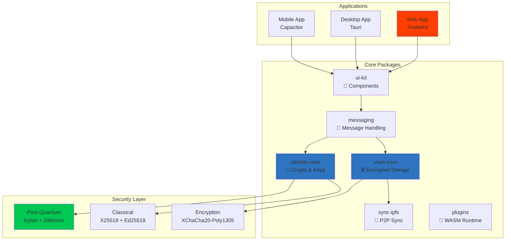

<div align="center">


# Post‑Quantum Secure, Local‑First Messaging

<p align="center">
  <a href="LICENSE"></a>
  <a href="https://www.typescriptlang.org/"></a>
  <a href="https://kit.svelte.dev/"></a>
  <a href="#"></a>
  <a href="docs/SECURITY.md"></a>
</p>

<h3>Private chat that stays private—even in a quantum future.</h3>

<br/>

</div>

> [!NOTE]
> **Project Status: 🚀 Web App Phase 1 Complete**  
> Full messaging, contact management, secure file storage, and vault functionality with 98.9% test coverage. Desktop and mobile apps coming soon!

<br/>

## 🌟 Why Choose Volli?

<table>
<thead>
<tr>
<th width="300">Feature</th>
<th width="200" align="center">Volli</th>
<th width="200" align="center">Signal/WhatsApp</th>
</tr>
</thead>
<tbody>
<tr>
<td><strong>🔮 Post‑Quantum Crypto</strong></td>
<td align="center">✅ Kyber + Dilithium</td>
<td align="center">❌ Not Yet</td>
</tr>
<tr>
<td><strong>💾 Local‑First Storage</strong></td>
<td align="center">✅ Device Only</td>
<td align="center">❌ Server Required</td>
</tr>
<tr>
<td><strong>🌐 Offline Operation</strong></td>
<td align="center">✅ Full Features</td>
<td align="center">❌ Limited</td>
</tr>
<tr>
<td><strong>🧩 Plugin Ecosystem</strong></td>
<td align="center">✅ WASM Sandbox</td>
<td align="center">❌ None</td>
</tr>
<tr>
<td><strong>🔗 P2P Sync</strong></td>
<td align="center">✅ IPFS/Direct</td>
<td align="center">❌ Centralized</td>
</tr>
</tbody>
</table>

> [!IMPORTANT]
> **Your messages never hit our servers—because we don't have any.**

<br/>

## 🚀 Quick Start

> [!TIP]
> Volli is **server‑less** in development too—your data lives in an encrypted SQLite db inside the browser or app sandbox.

<details open>
<summary><h3>📦 Installation</h3></summary>

```bash
# Clone the repository
git clone https://github.com/foofork/Volli.git
cd Volli

# Install dependencies
npm install

# Build packages
npm run build:packages

# Run the web app
cd apps/web && npm run dev     # → http://localhost:3000

# Run tests (98.9% coverage!)
npm test
```

</details>

<details>
<summary><h3>🖥️ Platform-Specific Builds</h3></summary>

#### Desktop (Tauri)
```bash
# Requires Rust toolchain
cd apps/desktop && npm run dev
```

#### Mobile (Capacitor)
```bash
# Requires Xcode/Android Studio
cd apps/mobile && npm run dev
```

</details>

<br/>

## ✨ Features

### 🎯 Available Now (Phase 1 Complete)

- [x] **🔐 Secure Vault** - Passphrase-protected local storage with encryption
- [x] **💬 E2E Messaging** - Send and receive encrypted messages
- [x] **👥 Contact Management** - Add, verify, and manage contacts with PKI
- [x] **📁 File Storage** - Encrypt and share files up to 10MB
- [x] **🔑 Strong Auth** - 128-bit entropy passphrase validation
- [x] **⏱️ Auto-lock** - Automatic vault locking after inactivity
- [x] **📱 Responsive UI** - Works on all screen sizes
- [x] **🧪 Test Coverage** - 98.9% coverage with comprehensive tests

### 🔜 Coming Soon

- [ ] **🔄 Real-time Sync** - Multi-device synchronization
- [ ] **🖥️ Desktop App** - Native Tauri application
- [ ] **📱 Mobile Apps** - iOS and Android with Capacitor
- [ ] **🔮 Full PQ Crypto** - Complete Kyber-1024 + Dilithium-3
- [ ] **🧩 Plugin System** - WASM-based extensibility
- [ ] **👥 Group Chat** - Multi-participant conversations

<br/>

## 🏗️ Architecture



> [!NOTE]
> See [Architecture Documentation](docs/ARCHITECTURE.md) for detailed system design.

<br/>

## 🔒 Security Overview

<table>
<thead>
<tr>
<th>Layer</th>
<th>Technology</th>
<th>Purpose</th>
</tr>
</thead>
<tbody>
<tr>
<td><strong>🔐 Encryption</strong></td>
<td>Kyber‑1024, XChaCha20</td>
<td>Post‑quantum confidentiality</td>
</tr>
<tr>
<td><strong>✍️ Signatures</strong></td>
<td>Dilithium‑3</td>
<td>Authentication & integrity</td>
</tr>
<tr>
<td><strong>🔑 KDF</strong></td>
<td>Argon2id</td>
<td>Password-based key derivation</td>
</tr>
<tr>
<td><strong>💾 Storage</strong></td>
<td>Encrypted SQLite + CRDT</td>
<td>Local‑first with sync</td>
</tr>
</tbody>
</table>

> [!CAUTION]
> **Security Disclosure**: Report vulnerabilities to security@volli.chat

<br/>

## 📊 Development Progress

### Phase 1: Core Web App ✅
- [x] Post-quantum crypto foundation
- [x] Encrypted local storage
- [x] Messaging functionality
- [x] Contact management
- [x] File storage & sharing
- [x] 98.9% test coverage

### Phase 2: Advanced Features 🚧
- [ ] Real-time P2P sync
- [ ] Group messaging
- [ ] Voice notes
- [ ] Message reactions

### Phase 3: Multi-Platform 🔜
- [ ] Desktop app (Tauri)
- [ ] iOS app (Capacitor)
- [ ] Android app (Capacitor)
- [ ] Cross-platform sync

### Phase 4: Full Crypto 🔮
- [ ] Complete PQ implementation
- [ ] Hardware key support
- [ ] Quantum-safe backups

<br/>

## 🛠️ Development

<details>
<summary><strong>📋 Available Scripts</strong></summary>

<br/>

| Script | Description |
|--------|-------------|
| `npm install` | Install all dependencies |
| `npm run build:packages` | Build all packages |
| `npm run test` | Run test suite (98.9% coverage) |
| `npm run lint` | Lint codebase |
| `npm run typecheck` | TypeScript validation |
| `npm run dev` | Start dev servers |

</details>

<details>
<summary><strong>📁 Project Structure</strong></summary>

<br/>

```
volli/
├── 📱 apps/              # Applications
│   ├── web/             # SvelteKit web app
│   ├── desktop/         # Tauri desktop app
│   └── mobile/          # Capacitor mobile app
├── 📦 packages/          # Core packages
│   ├── identity-core/   # Cryptography & identity
│   ├── vault-core/      # Encrypted storage
│   ├── messaging/       # Message handling
│   ├── sync-ipfs/       # P2P synchronization
│   ├── plugins/         # Plugin system
│   └── ui-kit/          # Shared components
└── 📚 docs/             # Documentation
```

</details>

<br/>

## 📚 Documentation

<div align="center">

| 📖 Document | 📝 Description |
|:------------|:---------------|
| [**Overview**](docs/OVERVIEW.md) | Project introduction and goals |
| [**Architecture**](docs/ARCHITECTURE.md) | System design and components |
| [**Security**](docs/SECURITY.md) | Cryptography and security model |
| [**Developer Guide**](docs/DEVELOPER.md) | Setup and development workflow |
| [**Roadmap**](docs/ROADMAP.md) | Development timeline and milestones |

</div>

<br/>

## 🤝 Contributing

We welcome contributions! See our [Developer Guide](docs/DEVELOPER.md) to get started.

<details>
<summary><strong>Quick Contribution Guide</strong></summary>

<br/>

1. Fork the repository
2. Create your feature branch (`git checkout -b feat/amazing-feature`)
3. Write tests first (TDD approach)
4. Implement your changes
5. Ensure tests pass (`npm test`)
6. Commit (`git commit -m 'feat: add amazing feature'`)
7. Push (`git push origin feat/amazing-feature`)
8. Open a Pull Request

</details>

<br/>

---

<div align="center">

**MIT © 2025 The Volli Authors**

<br/>

Built with ❤️ for privacy and autonomy  
**"Privacy is not granted—it's taken back."**

<br/>

<a href="https://github.com/foofork/Volli"></a>
<a href="https://github.com/foofork/Volli/fork"></a>
<a href="https://github.com/foofork/Volli/issues"></a>

</div>