<div align="center">


# Intelligent Privacy, User Sovereignty, Local‑First Messaging

<p align="center">
  <a href="LICENSE"></a>
  <a href="https://www.typescriptlang.org/"></a>
  <a href="https://kit.svelte.dev/"></a>
  <a href="#"></a>
  <a href="docs/SECURITY.md"></a>
</p>

<h3>The only messenger that adapts to you—not the other way around.</h3>

<br/>

</div>

> [!NOTE]
> **Project Status: 🚀 MVP Ready - Testing Phase**  
> Fully functional encrypted messenger with WebRTC P2P communication, signaling server for peer discovery, and encrypted local storage. Ready for real-world testing!

> [!TIP]
> **Current Focus**: Stabilization and user testing. The core messaging system is complete with signaling server. Next: Deploy and test with real users, then implement the Adaptive Trust "Go Dark" feature for seamless server-to-P2P transitions.

> [!IMPORTANT]
> **Want to Contribute?** Check out our [Task Board](docs/TASK_BOARD.md) to find available work!

## 💡 Why Privacy Shouldn't Be Hard

> **The Problem**: Every messaging app makes you choose—either sacrifice privacy for features, or sacrifice usability for security.
> 
> **Our Solution**: Volli's Adaptive Trust System intelligently adjusts security based on your context, while your sovereignty rules ensure you're always in control. No more all-or-nothing privacy.

<br/>

## 🌟 Why Choose Volli?

<table>
<thead>
<tr>
<th width="300">Feature</th>
<th width="200" align="center">Volli</th>
<th width="200" align="center">Signal/WhatsApp</th>
</tr>
</thead>
<tbody>
<tr>
<td><strong>🔗 P2P Messaging</strong></td>
<td align="center">✅ WebRTC Direct</td>
<td align="center">❌ Server Required</td>
</tr>
<tr>
<td><strong>💾 Local‑First Storage</strong></td>
<td align="center">✅ Encrypted Vault</td>
<td align="center">⚠️ Cloud Backup</td>
</tr>
<tr>
<td><strong>🌐 Offline Operation</strong></td>
<td align="center">✅ Message Queue</td>
<td align="center">❌ Limited</td>
</tr>
<tr>
<td><strong>🟣 "Go Dark" Mode</strong></td>
<td align="center">🚧 Next Feature</td>
<td align="center">❌ None</td>
</tr>
<tr>
<td><strong>🎯 Connection Trust</strong></td>
<td align="center">✅ Visual Indicators</td>
<td align="center">❌ Hidden</td>
</tr>
<tr>
<td><strong>🔮 Post‑Quantum</strong></td>
<td align="center">📅 Future</td>
<td align="center">❌ Not Yet</td>
</tr>
<tr>
<td><strong>👑 User Sovereignty</strong></td>
<td align="center">✅ Your Rules First</td>
<td align="center">❌ Platform Rules</td>
</tr>
</tbody>
</table>

> [!IMPORTANT]
> **Your privacy, your rules, your device—no exceptions, no compromises.**

### 🎯 The Volli Difference: Connection-Based Trust

Unlike other messengers that hide how you're connected, Volli shows you exactly what's happening with visual indicators:

- **Direct P2P**: Your messages go directly to your peer, no servers involved
- **Server-Assisted**: Using the signaling server for discovery, still encrypted
- **Unverified**: New contact, not yet verified

**"Go Dark" Feature**: Start with easy server-assisted connections, then upgrade to full P2P as trust builds. One tap to transition for maximum privacy.

**Your Control**: Every connection remembers your preference. The system learns but never overrides your choices.

<br/>

## 🚀 Quick Start

> [!SUCCESS]
> **Complete Messaging System**: WebRTC P2P messaging with signaling server for easy peer discovery. Messages are encrypted end-to-end, queued when offline, and your data stays in your encrypted local vault.

> [!TIP]
> **Two Ways to Connect**: Use the signaling server for easy username-based discovery, or share hex IDs for direct P2P connections. All messages are end-to-end encrypted regardless of connection method.

<details open>
<summary><h3>📦 Installation</h3></summary>

```bash
# Clone the repository
git clone https://github.com/foofork/Volli.git
cd Volli

# Install dependencies (requires pnpm)
pnpm install

# Start development servers
pnpm dev

# This starts:
# - Web app → http://localhost:5173
# - Signaling server → http://localhost:8080

# Run tests
pnpm test
```

</details>

<details>
<summary><h3>🖥️ Platform Support (Coming Soon)</h3></summary>

#### Desktop (Tauri) - Planned
```bash
# Not yet implemented
# Target: Month 3-4
```

#### Mobile (Capacitor) - Planned
```bash
# Not yet implemented  
# Target: Month 2-3 (PWA wrapper first)
```

**Current Status**: Web application only. Mobile and desktop apps are planned but not yet implemented.

</details>

<br/>

## ✨ Features

### 🎯 What's Working Today

- [x] **💬 Complete P2P Messaging** - WebRTC with automatic peer discovery
- [x] **📡 Signaling Server** - WebSocket server for easy peer connections
- [x] **🔐 End-to-End Encryption** - XChaCha20-Poly1305 for all messages
- [x] **💾 Encrypted Local Storage** - Vault system with Argon2id KDF
- [x] **🎨 Full Web Application** - Responsive UI for all features
- [x] **📨 Message Queue** - Offline support with automatic retry
- [x] **👥 Contact Management** - Add via username or hex ID
- [x] **🔑 Identity System** - Cryptographic identity generation
- [x] **🧪 Test Coverage** - ~80% across core packages
- [x] **📊 Real-time Status** - Connection and message delivery indicators

### 🚧 Coming Next

**Phase 1: Stabilization (Current)**
- [ ] **🐛 Fix Build Issues** - Resolve WASM configuration
- [ ] **✅ Update Tests** - Fix failing test expectations
- [ ] **🚀 Deploy MVP** - Production signaling server

**Phase 2: Trust Features**
- [ ] **🟣 "Go Dark" Mode** - Seamless server → P2P transition
- [ ] **🔄 Connection Memory** - Remember peer preferences
- [ ] **🎨 Trust UI** - Purple/Blue/Orange indicators
- [ ] **🔑 Remote Key Exchange** - P2P without meeting

**Phase 3: Platform Expansion**
- [ ] **📱 Mobile PWA** - Capacitor wrapper for iOS/Android
- [ ] **🖥️ Desktop App** - Tauri for Windows/Mac/Linux
- [ ] **👥 Group Messaging** - Multi-party conversations

**Future Features**
- [ ] **🔄 CRDT Sync** - Multi-device conflict resolution
- [ ] **📁 File Sharing** - Encrypted file transfer
- [ ] **🔮 Post-Quantum** - Future-proof cryptography
- [ ] **🧩 Plugin Marketplace** - Community extensions

<br/>

## 🏗️ Architecture

```mermaid
graph TD
    subgraph "Applications"
        A[Web App<br/>SvelteKit]
        B[Desktop App<br/>Tauri]
        C[Mobile App<br/>Capacitor]
    end
    
    subgraph "Core Packages"
        D[identity-core<br/>🔑 Crypto & Keys]
        E[vault-core<br/>🔒 Encrypted Storage]
        F[messaging<br/>💬 Message Handling]
        G[sync-ipfs<br/>🔄 P2P Sync]
        H[plugins<br/>🧩 WASM Runtime]
        I[ui-kit<br/>🎨 Components]
    end
    
    subgraph "Security Layer"
        J[Post-Quantum<br/>Kyber + Dilithium]
        K[Classical<br/>X25519 + Ed25519]
        L[Encryption<br/>XChaCha20-Poly1305]
    end
    
    A --> I
    B --> I
    C --> I
    I --> F
    F --> D
    F --> E
    E --> G
    D --> J
    D --> K
    E --> L
    
    style A fill:#FF3E00
    style D fill:#2F74C0
    style E fill:#2F74C0
    style J fill:#00C853
```



> [!NOTE]
> See [Architecture Documentation](docs/ARCHITECTURE.md) for detailed system design.

<br/>

## 🔒 Security Overview

<table>
<thead>
<tr>
<th>Layer</th>
<th>Technology</th>
<th>Purpose</th>
</tr>
</thead>
<tbody>
<tr>
<td><strong>🔐 Encryption</strong></td>
<td>XChaCha20-Poly1305</td>
<td>Message & storage encryption</td>
</tr>
<tr>
<td><strong>🔑 Key Exchange</strong></td>
<td>X25519</td>
<td>ECDH key agreement</td>
</tr>
<tr>
<td><strong>✍️ Signatures</strong></td>
<td>Ed25519</td>
<td>Authentication & integrity</td>
</tr>
<tr>
<td><strong>🔑 KDF</strong></td>
<td>Argon2id</td>
<td>Password-based key derivation</td>
</tr>
<tr>
<td><strong>💾 Storage</strong></td>
<td>IndexedDB (Dexie)</td>
<td>Encrypted local persistence</td>
</tr>
<tr>
<td><strong>🌐 Network</strong></td>
<td>WebRTC P2P</td>
<td>Direct peer connections</td>
</tr>
</tbody>
</table>

> [!CAUTION]
> **MVP Software**: Not yet audited for production use. Post-quantum crypto planned for future release.

<br/>

## 🎯 Connection-Based Trust (Coming Soon)

> [!INFO]
> **Visual Trust Indicators**: See exactly how you're connected to each contact with color-coded security levels.

### Connection Types

| Type | Icon | Description |
|------|------|-------------|
| **Direct P2P** | 🔒 | Maximum privacy, no servers |
| **Server-Assisted** | 🔐 | Encrypted via signaling server |
| **Unverified** | ⚠️ | New contact, not yet trusted |

### "Go Dark" Feature (Next Release)

- **Progressive Trust**: Start with server connections, upgrade to P2P
- **One-Tap Transition**: Easy switch to direct connection
- **Connection Memory**: System remembers your preferences
- **Remote Key Exchange**: Secure P2P without meeting in person

> [!TIP]
> See [Connection Modes Documentation](docs/adaptive-trust/ADAPTIVE_TRUST_CONNECTION_MODES.md) for details.

<br/>

## 📊 Development Progress

> See [detailed roadmap](docs/ROADMAP.md) for complete timeline and sprint planning.

### Phase 0: Foundation ✅ *(COMPLETE)*
- [x] Encrypted storage with IndexedDB
- [x] Vault system with secure key derivation
- [x] Core messaging architecture
- [x] Identity and crypto primitives

### Phase 1: P2P Messaging ✅ *(COMPLETE)*
- [x] WebRTC peer connections
- [x] Signaling server for discovery
- [x] Message queue with offline support
- [x] End-to-end encryption
- [x] Real-time connection status

### Phase 2: MVP Testing 🚧 *(CURRENT)*
- [x] Complete web application
- [x] Signaling server implementation
- [ ] Production deployment
- [ ] User testing and feedback
- [ ] Bug fixes and stabilization

### Phase 3: Trust Features *(NEXT)*
- [ ] "Go Dark" mode implementation
- [ ] Connection preference memory
- [ ] Visual trust indicators
- [ ] Remote key exchange protocol
### Phase 4: Multi-Platform 🔜
- [ ] Mobile PWA (Capacitor)
- [ ] Desktop app (Tauri)
- [ ] Group messaging
- [ ] Multi-device sync

<br/>

## 🛠️ Development

<details>
<summary><strong>📋 Available Scripts</strong></summary>

<br/>

| Script | Description |
|--------|-------------|
| `pnpm install` | Install all dependencies |
| `pnpm build` | Build all packages |
| `pnpm test` | Run test suite |
| `pnpm lint` | Lint codebase |
| `pnpm typecheck` | TypeScript validation |
| `pnpm dev` | Start web app + signaling server |

</details>

<details>
<summary><strong>📁 Project Structure</strong></summary>

<br/>

```
volli/
├── 📱 apps/              # Applications
│   ├── web/             # SvelteKit web app
│   ├── desktop/         # Tauri desktop app
│   └── mobile/          # Capacitor mobile app
├── 📦 packages/          # Core packages
│   ├── identity-core/   # Cryptography & identity
│   ├── vault-core/      # Encrypted storage
│   ├── messaging/       # Message handling
│   ├── sync-ipfs/       # P2P synchronization
│   ├── plugins/         # Plugin system
│   └── ui-kit/          # Shared components
└── 📚 docs/             # Documentation
```

</details>

<br/>

## 📚 Documentation

<div align="center">

| 📖 Document | 📝 Description |
|:------------|:---------------|
| [**Getting Started**](docs/GETTING_STARTED.md) | Quick setup and first steps |
| [**Project Status**](docs/PROJECT_STATUS.md) | Current implementation state |
| [**Architecture**](docs/ARCHITECTURE.md) | System design and components |
| [**Security**](docs/SECURITY.md) | Cryptography and security model |
| [**Current Tasks**](docs/CURRENT_TASKS.md) | What needs to be done |
| [**Connection Trust**](docs/adaptive-trust/ADAPTIVE_TRUST_CONNECTION_MODES.md) | Trust model documentation |

</div>

<br/>

## 🤝 Contributing

> [!NOTE]
> **Contributions Welcome!** Check [Current Tasks](docs/CURRENT_TASKS.md) for work items and [Contributing Guide](docs/CONTRIBUTING_WORKFLOW.md) for how to help.

<br/>

---

<div align="center">

**MIT © 2025 The Volli Authors**

<br/>

Built with ❤️ for privacy and autonomy  
**"Privacy that adapts to you—not the other way around."**

<br/>

<a href="https://github.com/foofork/Volli"></a>
<a href="https://github.com/foofork/Volli/fork"></a>
<a href="https://github.com/foofork/Volli/issues"></a>

</div>