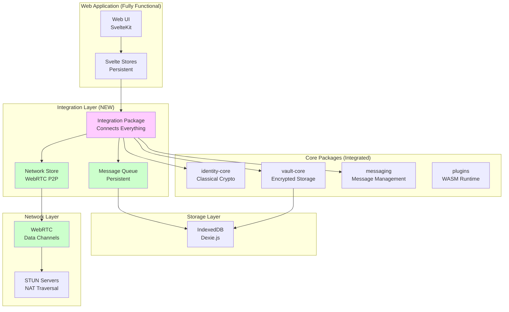
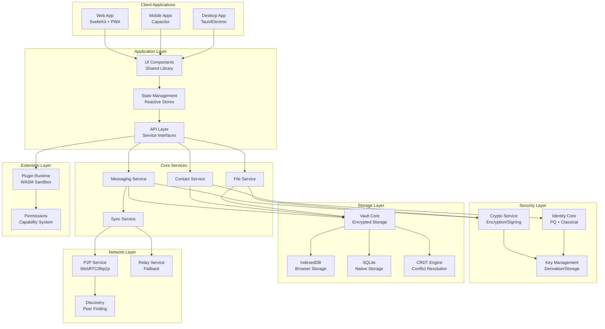
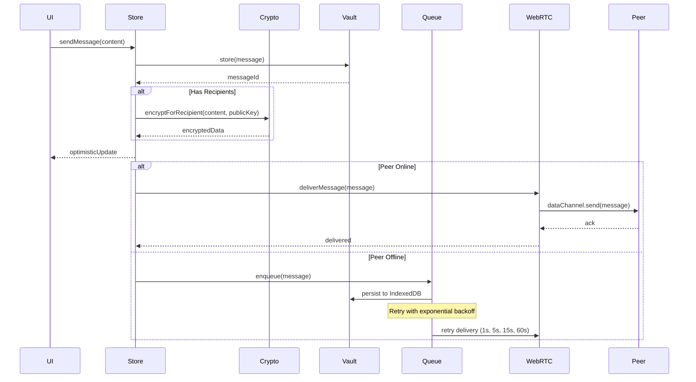
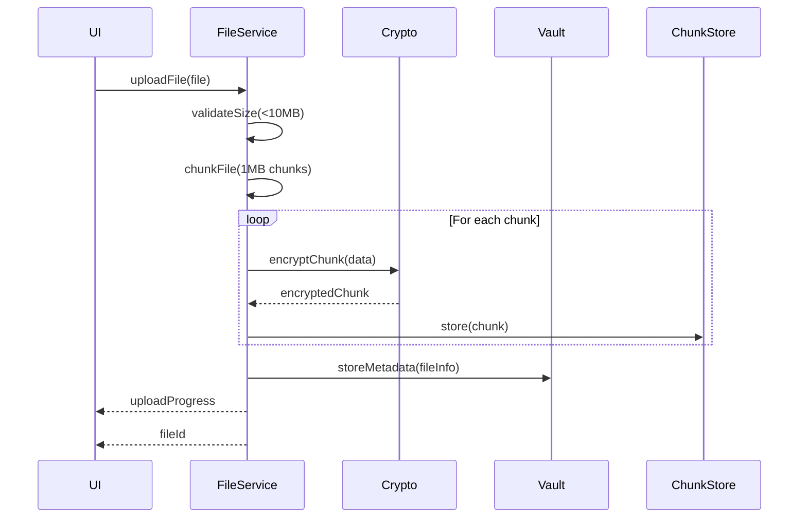
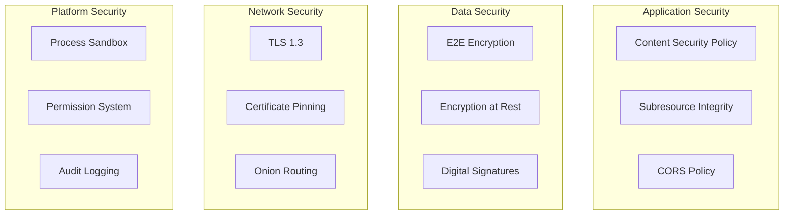
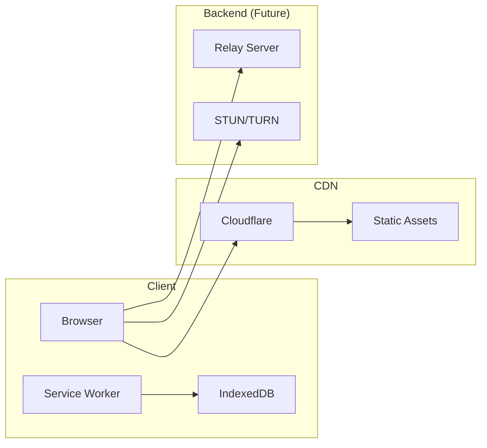

# 🏗️ Volli System Architecture

## Executive Summary

Volli is a privacy-first messaging platform designed for post-quantum security and local-first operation. This document provides a comprehensive architectural overview, distinguishing between current implementation and planned features.

## Table of Contents
1. [Architecture Principles](#architecture-principles)
2. [Current State Architecture](#current-state-architecture)
3. [Target Architecture](#target-architecture)
4. [Component Details](#component-details)
5. [Data Flow](#data-flow)
6. [Performance & Modularity Standards](#performance--modularity-standards)
7. [Security Architecture](#security-architecture)
8. [Technology Stack](#technology-stack)
9. [Deployment Architecture](#deployment-architecture)
10. [Architecture Decision Records](#architecture-decision-records)

---

## Architecture Principles

### Core Tenets
1. **Local-First**: All operations work offline; network is only for sync
2. **Zero-Trust**: No plaintext or key material on servers
3. **Privacy by Design**: Minimal metadata, end-to-end encryption
4. **Modularity**: Small, focused components with clear boundaries
5. **Performance**: Sub-100ms operations, <500 lines per file

### Design Principles
- **Progressive Enhancement**: Basic features work everywhere
- **Fail Secure**: Security failures result in denial, not exposure
- **Explicit Over Implicit**: Clear data flow and dependencies
- **Testability**: 95%+ test coverage requirement
- **Documentation**: Code is self-documenting with types

---

## Current State Architecture

### What's Actually Built (January 2025)


### Current Capabilities
- **Full Persistence**: IndexedDB with Dexie
- **Real Encryption**: libsodium with per-recipient encryption
- **P2P Networking**: WebRTC data channels for messaging
- **Message Queue**: Persistent with retry logic
- **All Packages Integrated**: Via integration layer

---

## Target Architecture

### Complete System Design


---

## Component Details

### 1. Identity Core (`@volli/identity-core`)

**Current State**: Classical crypto only (X25519, Ed25519)  
**Target State**: Post-quantum (Kyber-1024, Dilithium-3) with hybrid mode

#### Responsibilities
- Identity generation and management
- Key derivation and rotation
- Device pairing protocols
- Signature generation/verification

#### Key Interfaces
```typescript
interface IdentityCore {
  // Identity Management
  generateIdentity(params: IdentityParams): Promise<Identity>
  importIdentity(data: IdentityData): Promise<Identity>
  exportIdentity(id: string): Promise<IdentityData>
  
  // Key Operations
  deriveSessionKey(identity: Identity, purpose: KeyPurpose): SessionKey
  rotateKeys(identity: Identity): Promise<Identity>
  
  // Device Pairing
  generatePairingCode(): PairingCode
  completePairing(code: PairingCode, pin: string): Promise<Identity>
}

interface Identity {
  id: string
  publicKey: PublicKey
  privateKey: PrivateKey
  algorithm: 'classical' | 'pq' | 'hybrid'
  created: number
  rotationSchedule?: KeyRotation
}
```

#### Performance Requirements
- Key generation: < 200ms (classical), < 500ms (PQ)
- Signature operations: < 50ms
- Memory usage: < 10MB per identity

### 2. Vault Core (`@volli/vault-core`)

**Current State**: SQL.js implementation exists but not integrated  
**Target State**: Multi-backend support with encryption

#### Responsibilities
- Encrypted local storage
- CRDT-based synchronization
- Data migration and versioning
- Query and indexing

#### Storage Architecture
```typescript
interface VaultCore {
  // Storage Operations
  initialize(config: VaultConfig): Promise<Vault>
  store<T>(collection: string, item: T): Promise<string>
  retrieve<T>(collection: string, id: string): Promise<T>
  query<T>(collection: string, filter: Filter): Promise<T[]>
  
  // Sync Operations
  getChanges(since: Timestamp): Promise<Change[]>
  applyChanges(changes: Change[]): Promise<void>
  resolveConflicts(strategy: ConflictStrategy): Promise<void>
}

interface VaultConfig {
  backend: 'indexeddb' | 'sqlite' | 'memory'
  encryption: EncryptionConfig
  sync?: SyncConfig
  migrations?: Migration[]
}
```

#### Storage Schema
```sql
-- Core tables with encryption
CREATE TABLE objects (
  id TEXT PRIMARY KEY,
  collection TEXT NOT NULL,
  data_encrypted BLOB NOT NULL,
  nonce BLOB NOT NULL,
  created_at INTEGER NOT NULL,
  updated_at INTEGER NOT NULL,
  deleted_at INTEGER,
  crdt_clock TEXT,
  INDEX idx_collection (collection),
  INDEX idx_updated (updated_at)
);

CREATE TABLE metadata (
  key TEXT PRIMARY KEY,
  value_encrypted BLOB NOT NULL,
  nonce BLOB NOT NULL
);
```

### 3. Messaging Service

**Current State**: Fully implemented with P2P delivery  
**Enhancements**: Per-recipient encryption, persistent queue

#### Architecture
```typescript
interface MessagingService {
  // Message Operations
  sendMessage(
    conversationId: string, 
    content: string, 
    senderVault: Vault,
    recipientIds?: string[]
  ): Promise<Message>
  
  // Encryption
  encryptForRecipient(content: string, recipientPublicKey: string): Promise<string>
  getContactPublicKey(contactId: string): Promise<string | null>
  
  // Conversation Management
  getMessages(conversationId: string): Promise<Message[]>
  getConversations(): Promise<string[]>
  
  // Message Management
  markAsRead(messageId: number): Promise<void>
  deleteMessage(messageId: number): Promise<void>
  deleteConversation(conversationId: string): Promise<void>
}

interface Message {
  id?: number
  conversationId: string
  content: string
  senderId: string
  timestamp: number
  status: 'pending' | 'sent' | 'delivered' | 'read'
  encryptedContent?: string // Per-recipient encrypted versions
}
```

### 4. Network Store (NEW)

**Current State**: WebRTC implementation with data channels  
**Features**: Peer management, automatic reconnection, message queuing

#### Architecture
```typescript
interface NetworkStore {
  // Connection Management
  connectToPeer(peerId: string, offer?: RTCSessionDescriptionInit): Promise<void>
  disconnect(): Promise<void>
  
  // Status
  isOnline: boolean
  peers: Map<string, RTCPeerConnection>
  dataChannels: Map<string, RTCDataChannel>
  
  // Message Handling
  getSyncEndpoint(): Promise<SyncEndpoint>
  onMessage(handler: (message: Message) => void): () => void
}

interface SyncEndpoint {
  getMessages(since?: number): Promise<Message[]>
  sendMessage(message: Message): Promise<boolean>
}
```

### 5. Message Queue (NEW)

**Current State**: Persistent queue with retry logic  
**Features**: Exponential backoff, delivery tracking

#### Architecture
```typescript
interface PersistentMessageQueue {
  // Queue Operations
  enqueue(message: Message): Promise<void>
  getPending(): Promise<QueuedMessage[]>
  
  // Delivery Management
  markDelivered(messageId: number): Promise<void>
  markFailed(messageId: number, error: string): Promise<void>
  
  // Utilities
  clear(): Promise<void>
  getQueueSize(): Promise<number>
}

interface QueuedMessage {
  id?: number
  message: Message
  attempts: number
  lastAttempt?: number
  nextRetry?: number  // Exponential backoff: 1s, 5s, 15s, 60s
  error?: string
}
```

### 4. Plugin System

**Current State**: WASM runtime implemented  
**Target State**: Full ecosystem with marketplace

#### Security Model
```typescript
interface PluginRuntime {
  // Lifecycle
  loadPlugin(wasm: ArrayBuffer, manifest: Manifest): Promise<Plugin>
  unloadPlugin(id: string): Promise<void>
  
  // Execution
  executeFunction(pluginId: string, fn: string, args: any[]): Promise<any>
  
  // Permissions
  checkPermission(pluginId: string, capability: Capability): boolean
  grantPermission(pluginId: string, capability: Capability): void
}

interface Manifest {
  name: string
  version: string
  capabilities: {
    required: Capability[]
    optional: Capability[]
  }
  resources: {
    memory: number  // bytes
    cpu: number     // milliseconds per call
    storage: number // bytes
  }
}
```

---

## Data Flow

### Message Send Flow (Implemented)


### File Storage Flow


---

## Performance & Modularity Standards

### Code Organization

#### File Size Limits
- **Maximum file size**: 500 lines (enforced by linter)
- **Ideal file size**: 100-300 lines
- **Maximum function size**: 50 lines
- **Maximum complexity**: Cyclomatic complexity < 10

#### Module Structure
```
src/
├── lib/
│   ├── services/         # Business logic (100-300 lines each)
│   ├── stores/           # State management (100-200 lines each)
│   ├── components/       # UI components (50-150 lines each)
│   ├── utils/            # Helpers (50-100 lines each)
│   └── types/            # TypeScript types (interfaces only)
├── routes/               # Route handlers (50-100 lines each)
└── tests/                # Mirrors src structure
```

### Performance Budgets

#### Client-Side Metrics
| Metric | Target | Maximum |
|--------|--------|---------|
| Initial Load | < 100KB | 200KB |
| Time to Interactive | < 2s | 3s |
| First Contentful Paint | < 1s | 1.5s |
| API Response Time | < 100ms | 200ms |
| Memory Usage | < 50MB | 100MB |

#### Operation Performance
| Operation | Target | Maximum |
|-----------|--------|---------|
| Message Encrypt/Decrypt | < 50ms | 100ms |
| File Chunk Encryption | < 100ms | 200ms |
| Database Query | < 20ms | 50ms |
| CRDT Merge | < 50ms | 100ms |
| Plugin Execution | < 100ms | 500ms |

### Code Quality Metrics

#### Enforced by CI/CD
```yaml
quality_gates:
  coverage:
    statements: 95%
    branches: 90%
    functions: 95%
    lines: 95%
  
  complexity:
    max_cyclomatic: 10
    max_cognitive: 15
    max_file_lines: 500
    max_function_lines: 50
  
  duplication:
    max_duplicate_lines: 20
    max_duplicate_blocks: 2
  
  dependencies:
    max_bundle_size: 200KB
    tree_shaking: required
    security_audit: required
```

### Monitoring & Observability

#### Performance Monitoring
```typescript
interface PerformanceMonitor {
  // Timing
  startTimer(operation: string): Timer
  endTimer(timer: Timer): void
  
  // Metrics
  recordMetric(name: string, value: number): void
  recordError(error: Error, context: Context): void
  
  // Reporting
  getMetrics(): Metrics
  generateReport(): PerformanceReport
}
```

---

## Security Architecture

### Threat Model

#### In-Scope Threats
1. **Network Adversaries**: Eavesdropping, MITM attacks
2. **Compromised Servers**: Zero-trust design
3. **Device Theft**: Encrypted at rest
4. **Quantum Computing**: Post-quantum algorithms
5. **Malicious Plugins**: Sandboxed execution

#### Out-of-Scope Threats
1. **Compromised OS**: Kernel-level attacks
2. **Hardware Attacks**: Side-channel, cold boot
3. **Social Engineering**: User deception
4. **Legal Compulsion**: Warrant canaries

### Security Layers



---

## Technology Stack

### Current Stack (January 2025)

| Layer | Technology | Status | Notes |
|-------|------------|--------|-------|
| Frontend | SvelteKit 2.0 | ✅ Active | Type-safe, performant |
| State | Svelte Stores | ✅ Persistent | IndexedDB backed |
| Crypto | libsodium.js | ✅ Active | Classical, per-recipient encryption |
| Storage | IndexedDB/Dexie | ✅ Active | Encrypted, persistent |
| Network | WebRTC | ✅ Active | P2P data channels |
| Queue | Custom | ✅ Active | Persistent with retry |
| Testing | Vitest | ✅ Active | 89.7% coverage |

### Implemented Technologies

| Layer | Choice | Reasoning |
|-------|--------|-----------|
| Storage | Dexie.js | Best IndexedDB wrapper, TypeScript support |
| P2P | WebRTC | Browser native, reliable data channels |
| Queue | Custom implementation | Tailored retry logic, IndexedDB persistence |
| Integration | New package | Clean separation of concerns |

### Still Evaluating

| Layer | Options | Decision Criteria |
|-------|---------|-------------------|
| CRDT | Yjs, Automerge | Performance, conflict resolution |
| PQ Crypto | liboqs, pqc-js, kyber-crystals | WASM support, performance |
| Signaling | Socket.io, Firebase, custom | Simplicity, scalability |
| Desktop | Tauri, Electron | Security, bundle size |
| Mobile | Capacitor, React Native | Code reuse, performance |

---

## Deployment Architecture

### Web Deployment


### Desktop/Mobile Deployment
- **Desktop**: Direct download, auto-updater
- **Mobile**: App stores with OTA updates
- **Updates**: Delta updates for efficiency

---

## Architecture Decision Records

### ADR-001: Local-First Architecture
**Status**: Accepted  
**Context**: Users need privacy and offline functionality  
**Decision**: All data stored locally, sync is optional  
**Consequences**: Complex sync, better privacy

### ADR-002: WASM Plugin System
**Status**: Accepted  
**Context**: Need extensibility without compromising security  
**Decision**: WASM sandbox with capability model  
**Consequences**: Performance overhead, strong security

### ADR-003: Post-Quantum Crypto
**Status**: Planned  
**Context**: Quantum computers threaten current crypto  
**Decision**: Hybrid classical + PQ approach  
**Consequences**: Larger keys, slower operations

### ADR-004: Browser Storage Strategy
**Status**: Accepted  
**Context**: Need persistent encrypted storage  
**Decision**: Dexie.js for IndexedDB management  
**Consequences**: Excellent TypeScript support, reactive queries, migration support

### ADR-005: P2P Messaging Implementation
**Status**: Accepted (January 2025)  
**Context**: Need direct peer-to-peer messaging without servers  
**Decision**: WebRTC with data channels  
**Consequences**: 
- ✅ Browser native support
- ✅ Reliable, ordered delivery
- ✅ Works with STUN servers
- ❌ Requires signaling for initial connection
- ❌ Complex NAT traversal scenarios need TURN

### ADR-006: Message Queue Design
**Status**: Accepted (January 2025)  
**Context**: Need reliable message delivery with offline support  
**Decision**: Custom persistent queue with exponential backoff  
**Consequences**: 
- ✅ Messages survive app restarts
- ✅ Automatic retry with backoff
- ✅ Delivery tracking
- ✅ Failed message handling

---

## Appendix: Development Guidelines

### Code Review Checklist
- [ ] File size < 500 lines
- [ ] Function complexity < 10
- [ ] Test coverage > 95%
- [ ] TypeScript strict mode
- [ ] No any types
- [ ] Performance budget met
- [ ] Security review passed
- [ ] Documentation updated

### Performance Testing
```bash
# Run performance benchmarks
npm run perf:benchmark

# Profile bundle size
npm run perf:bundle

# Memory profiling
npm run perf:memory

# Load testing
npm run perf:load
```

### Security Testing
```bash
# Dependency audit
npm audit

# OWASP scan
npm run security:scan

# Fuzzing
npm run security:fuzz
```

---

*Last Updated: January 2025*  
*Version: 3.0 - P2P Implementation Complete*