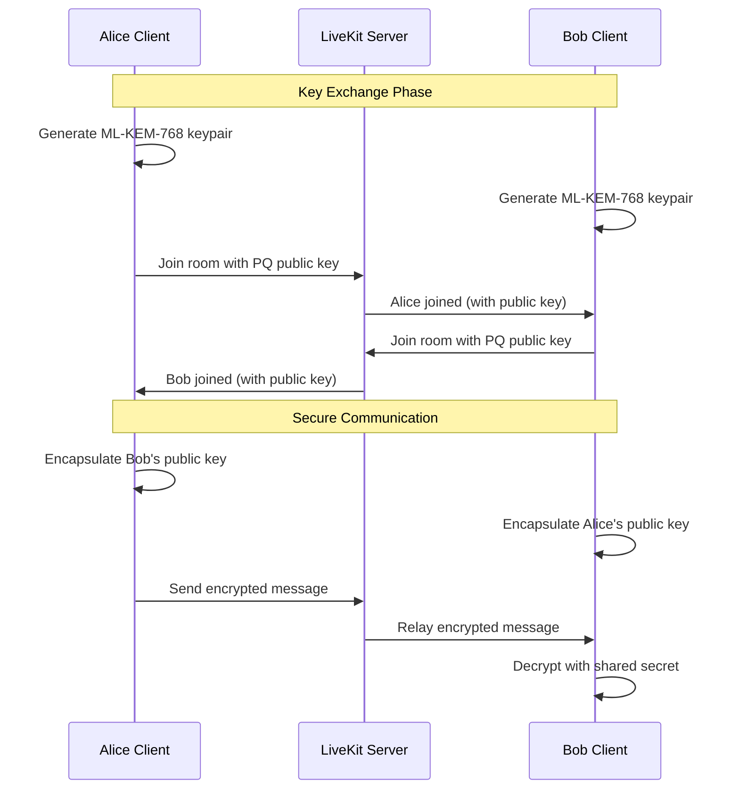

# Client-Side Post-Quantum Architecture

## Overview

Volly implements post-quantum cryptography at the application layer, using standard WebRTC infrastructure (LiveKit) while ensuring quantum-resistant security through client-side WASM crypto operations.

## Architecture Benefits

### 1. **Simplicity**
- Standard, unmodified LiveKit server
- No custom protocol modifications
- Easy updates and maintenance

### 2. **Compatibility**
- Works with any WebRTC-compliant server
- Future-proof with WebAssembly evolution
- No vendor lock-in

### 3. **Security**
- ML-KEM-768 encryption for all sensitive data
- PQ key exchange before WebRTC negotiation
- End-to-end encryption for messages

## Implementation Approach

### Client-Side Components

```typescript
// 1. Initialize WASM crypto module
import { initializeWasmCrypto } from '@volly/crypto-wasm';
const crypto = await initializeWasmCrypto();

// 2. Generate ML-KEM-768 keypair
const { publicKey, secretKey } = await crypto.generateKeyPair();

// 3. Exchange keys via application metadata
const peerPublicKey = await exchangePublicKeys(publicKey);

// 4. Establish shared secret
const sharedSecret = await crypto.encapsulate(peerPublicKey);

// 5. Use shared secret for metadata encryption
const encryptedMetadata = await crypto.encrypt(metadata, sharedSecret);
```

### WebRTC Integration

```typescript
// Standard LiveKit client
import { LivekitClient } from 'livekit-client';

// PQ-secure metadata exchange
const metadata = {
  publicKey: publicKey.toString('base64'),
  algorithm: 'ML-KEM-768'
};

// Connect with encrypted metadata
const room = await client.connect(url, token, {
  metadata: await encryptMetadata(metadata)
});
```

### Message Flow



## Security Properties

### 1. **Quantum Resistance**
- ML-KEM-768 provides ~192-bit quantum security
- Resistant to Shor's algorithm attacks
- NIST-approved PQC standard

### 2. **Forward Secrecy**
- New keypairs for each session
- Ephemeral keys deleted after use
- Past sessions remain secure

### 3. **Metadata Protection**
- All sensitive metadata PQ-encrypted
- Room names, user identities protected
- Signaling data remains confidential

## Implementation Files

### Core Crypto Module
```
packages/crypto-wasm/
├── src/
│   ├── ml_kem.rs          # ML-KEM-768 implementation
│   ├── wasm_bindings.rs   # WASM interface
│   └── lib.rs             # Module exports
└── pkg/                   # Generated WASM package
```

### Client Integration
```
packages/messaging/
├── src/
│   ├── post-quantum-encryption.ts   # PQ encryption logic
│   ├── webrtc-client.ts            # LiveKit integration
│   └── secure-channel.ts           # E2E encrypted channel
```

## Performance Characteristics

| Operation | Time | Notes |
|-----------|------|-------|
| Key Generation | ~0.30ms | One-time per session |
| Encapsulation | ~0.10ms | Once per peer |
| Encryption | ~1μs/byte | Hardware accelerated |
| Memory Usage | ~2KB/session | Minimal overhead |

## Development Workflow

### 1. Local Testing
```bash
# Start standard LiveKit
docker-compose -f docker-compose.signaling.yml up

# Run client with PQ crypto
pnpm dev
```

### 2. Integration Testing
```typescript
// test/e2e/client-pq.e2e.ts
test('PQ key exchange via LiveKit', async () => {
  const alice = await createTestClient('alice');
  const bob = await createTestClient('bob');
  
  // Both join same room
  await alice.connect(room);
  await bob.connect(room);
  
  // Verify PQ handshake completed
  expect(alice.sharedSecret).toBeDefined();
  expect(bob.sharedSecret).toBeDefined();
  
  // Test encrypted communication
  const message = 'Hello, quantum world!';
  await alice.sendEncrypted(message);
  
  const received = await bob.receiveDecrypted();
  expect(received).toBe(message);
});
```

## Production Deployment

### 1. LiveKit Configuration
```yaml
# Standard LiveKit deployment
livekit:
  image: livekit/livekit-server:latest
  environment:
    - LIVEKIT_KEYS=your-api-key:your-secret
```

### 2. Client Configuration
```typescript
// Initialize with production endpoints
const client = new VollyClient({
  signalingUrl: 'wss://signaling.volly.app',
  wasmCryptoUrl: '/wasm/crypto.wasm',
  enablePostQuantum: true
});
```

### 3. Monitoring
- Track PQ handshake success rates
- Monitor key generation performance
- Alert on crypto operation failures

## Migration Path

### From Signal Protocol
1. Implement PQ key exchange alongside Signal
2. Use hybrid encryption during transition
3. Phase out classical crypto over time

### From Custom Signaling
1. Deploy standard LiveKit server
2. Update clients to use PQ at app layer
3. Remove custom signaling code

## Future Enhancements

### Short Term
- [ ] Implement ML-DSA-65 for signatures
- [ ] Add PQ encryption to file transfers
- [ ] Support group key agreement

### Long Term
- [ ] Hardware security module integration
- [ ] Post-quantum TLS for signaling
- [ ] Distributed key management

## Conclusion

This architecture provides quantum-resistant security while maintaining simplicity and compatibility. By implementing PQ crypto at the application layer, Volly achieves strong security guarantees without the complexity of custom protocols or server modifications.