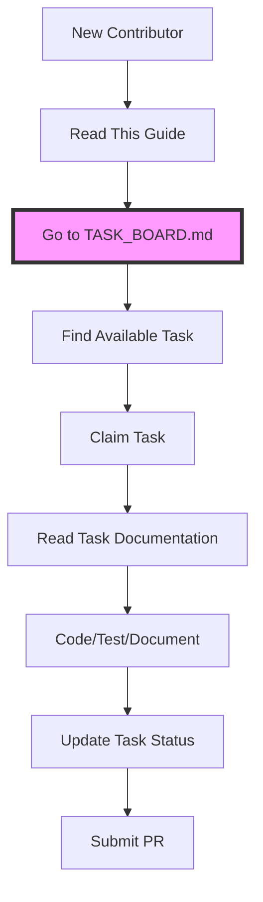

# Contributing to Volli - Complete Workflow

## The One-Stop Workflow



## Step-by-Step Guide

### 1. Start at the Task Board
**[TASK_BOARD.md](./TASK_BOARD.md)** is your single source of truth for:
- What work is available
- What's already being worked on
- Task status and ownership
- Links to relevant documentation

### 2. Claim Your Task
1. Find a task marked 🟢 Available
2. Edit TASK_BOARD.md to claim it:
   ```diff
   - | Network Detector | 🟢 Available | - | [Docs](link) | WiFi trust |
   + | Network Detector | 🔴 In Progress | @yourname | [Docs](link) | WiFi trust |
   ```
3. Commit this change immediately so others know

### 3. Read the Documentation
Each task links to its specific documentation:
- Technical specifications
- Implementation guidelines  
- Phase requirements (Alpha/Beta/GA)
- Testing requirements

### 4. Set Up Your Branch
```bash
git checkout -b feature/task-name
# Example: git checkout -b feature/adaptive-trust-network-detector
```

### 5. Do the Work
Follow the TDD approach outlined in documentation:
1. Write tests first (RED)
2. Implement minimum to pass (GREEN)
3. Refactor and optimize (REFACTOR)

### 6. Update Task Progress
As you work, update the task board with progress:
```markdown
#### Network Detector
**Owner**: @yourname  
**Update Date**: 2025-01-26  
**Progress**:
- ✅ Tests written for WiFi detection
- ✅ Basic implementation complete
- 🔄 Working on caching
- ❌ Blocked: Need clarification on trust levels
```

### 7. Complete the Task
When done:
1. Update status to ✅ Complete
2. Create a Pull Request
3. Reference the task in your PR description

## What NOT to Do

❌ **Don't** look for tasks in multiple documents  
❌ **Don't** create new task lists in documentation  
❌ **Don't** work on unclaimed tasks  
❌ **Don't** claim multiple tasks at once  
❌ **Don't** forget to update status  

## Documentation Structure

```
TASK_BOARD.md (START HERE)
    ├── Links to → Implementation Guides
    ├── Links to → Architecture Docs
    ├── Links to → API References
    └── Links to → Phase Requirements
```

## Example: Complete Task Flow

1. **Alice visits TASK_BOARD.md**
   - Sees "Network Detector" is available
   - Claims it by adding her name

2. **Alice reads linked documentation**
   - [Adaptive Trust Phasing Plan](./adaptive-trust/ADAPTIVE_TRUST_PHASING_PLAN.md#network-detector)
   - Understands Alpha scope: WiFi trust only

3. **Alice implements the feature**
   - Creates `feature/adaptive-trust-network-detector`
   - Writes tests first
   - Implements NetworkDetector class
   - Updates progress on task board

4. **Alice completes the task**
   - Marks as ✅ Complete on board
   - Creates PR with reference to task
   - Moves on to next available task

## Questions?

- **Technical questions**: Check documentation linked from task
- **Process questions**: See this guide
- **Blocked?**: Update task with blocker and ask in team chat
- **Found a bug in process?**: Update this guide!

Remember: **TASK_BOARD.md is the single source of truth for all work.**