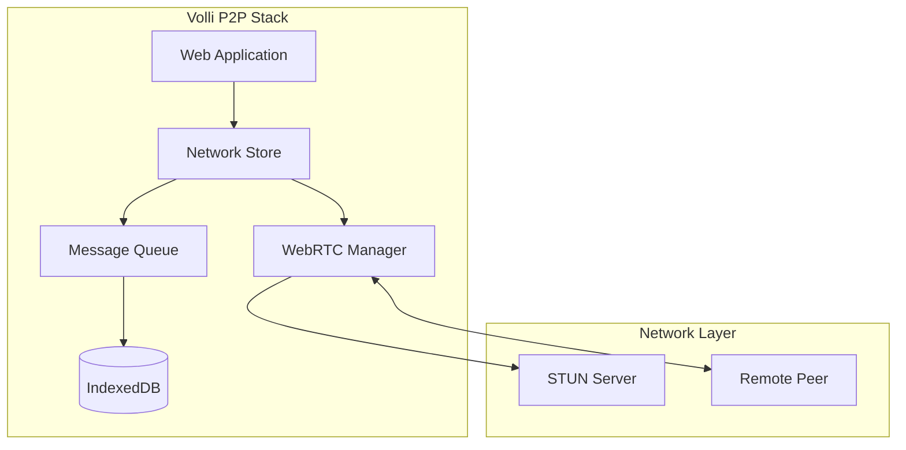
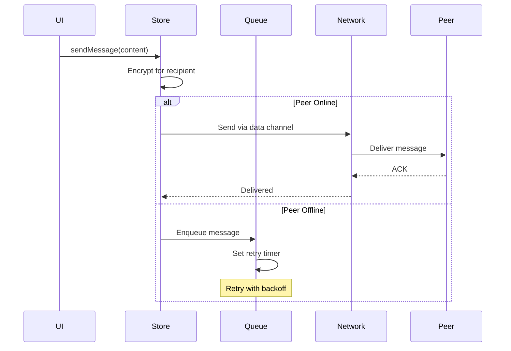
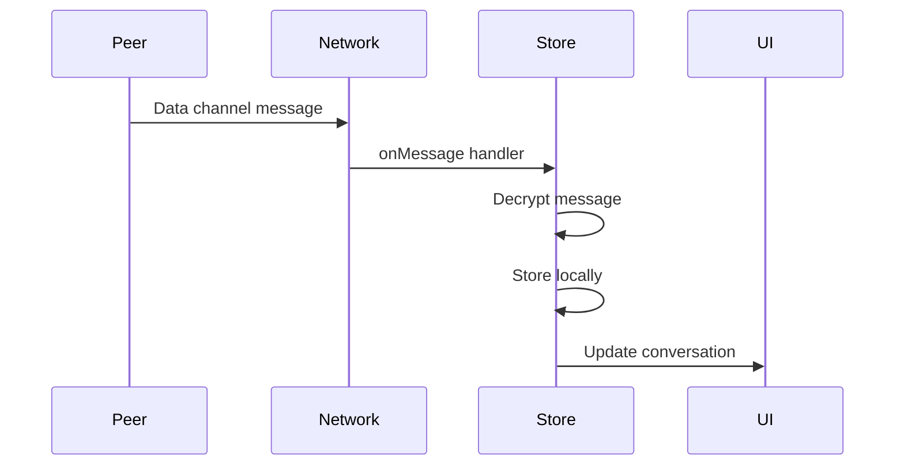
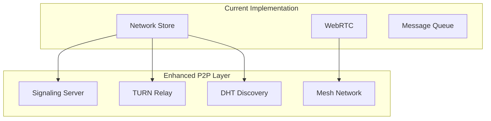

# 🌐 Volli P2P Networking Documentation

## Overview

Volli implements peer-to-peer messaging using WebRTC data channels, providing direct, encrypted communication between users without relying on centralized servers. This document details the P2P implementation, architecture, and usage.

## Table of Contents

1. [Architecture](#architecture)
2. [Implementation Details](#implementation-details)
3. [Message Flow](#message-flow)
4. [Security Model](#security-model)
5. [Configuration](#configuration)
6. [API Reference](#api-reference)
7. [Troubleshooting](#troubleshooting)
8. [Future Enhancements](#future-enhancements)

---

## Architecture

### Core Components



### Key Technologies

- **WebRTC**: Browser-native P2P communication
- **STUN**: NAT traversal (using Google's public servers)
- **IndexedDB**: Persistent storage via Dexie.js
- **libsodium**: End-to-end encryption

---

## Implementation Details

### Network Store

Located at `packages/integration/src/network/network-store.ts`

```typescript
export class NetworkStore {
  private peers: Map<string, RTCPeerConnection> = new Map();
  private dataChannels: Map<string, RTCDataChannel> = new Map();
  private messageHandlers: Set<(message: Message) => void> = new Set();
  
  isOnline: boolean = navigator.onLine;
  
  async connectToPeer(
    peerId: string, 
    offer?: RTCSessionDescriptionInit
  ): Promise<RTCSessionDescriptionInit | void>
}
```

### Message Queue

Located at `packages/integration/src/message-queue.ts`

```typescript
export class PersistentMessageQueue {
  constructor(private db: AppDatabase) {}
  
  async enqueue(message: Message): Promise<void>
  async getPending(): Promise<QueuedMessage[]>
  async markDelivered(messageId: number): Promise<void>
  async markFailed(messageId: number, error: string): Promise<void>
}
```

### Retry Logic

Messages are retried with exponential backoff:
- 1st retry: 1 second
- 2nd retry: 5 seconds
- 3rd retry: 15 seconds
- 4th retry: 60 seconds
- After 4 attempts: Manual intervention required

---

## Message Flow

### Sending Messages



### Receiving Messages



---

## Security Model

### Encryption Layers

1. **Application Layer**: Per-recipient encryption using public keys
2. **Transport Layer**: WebRTC DTLS encryption
3. **Storage Layer**: Encrypted IndexedDB with user passphrase

### Key Exchange Process

```typescript
// Each message is encrypted for specific recipients
interface EncryptedMessage {
  conversationId: string;
  senderPublicKey: string;
  recipients: {
    [recipientId: string]: {
      encryptedKey: string;  // Key encrypted with recipient's public key
      nonce: string;
    }
  };
  ciphertext: string;  // Message encrypted with shared key
}
```

### Security Considerations

- **No plaintext on the wire**: All messages encrypted before transmission
- **Forward secrecy**: Each message uses unique encryption keys
- **Authentication**: Messages signed with sender's Ed25519 key
- **Integrity**: AEAD encryption ensures message integrity

---

## Configuration

### STUN Servers

Default configuration uses Google's public STUN servers:

```typescript
const configuration: RTCConfiguration = {
  iceServers: [
    { urls: 'stun:stun.l.google.com:19302' },
    { urls: 'stun:stun1.l.google.com:19302' }
  ]
};
```

### Custom Configuration

```typescript
// Use custom STUN/TURN servers
const customConfig = {
  iceServers: [
    { urls: 'stun:your-stun-server.com:3478' },
    {
      urls: 'turn:your-turn-server.com:3478',
      username: 'user',
      credential: 'pass'
    }
  ]
};

networkStore.setConfiguration(customConfig);
```

---

## API Reference

### Network Store Methods

#### `connectToPeer(peerId: string, offer?: RTCSessionDescriptionInit)`
Establishes connection with a peer. Returns offer/answer for signaling.

#### `disconnect()`
Closes all peer connections and cleans up resources.

#### `getSyncEndpoint()`
Returns endpoint for message synchronization.

#### `onMessage(handler: (message: Message) => void)`
Registers handler for incoming messages. Returns cleanup function.

### Message Queue Methods

#### `enqueue(message: Message)`
Adds message to persistent queue for delivery.

#### `getPending()`
Returns all messages awaiting delivery.

#### `markDelivered(messageId: number)`
Marks message as successfully delivered.

#### `markFailed(messageId: number, error: string)`
Records delivery failure and schedules retry.

---

## Troubleshooting

### Connection Issues

#### Check ICE Candidates
```javascript
// In browser console
const pc = messagesStore.networkStore.peers.get('peer-id');
pc.onicecandidate = (event) => {
  console.log('ICE candidate:', event.candidate);
};
```

#### Monitor Connection State
```javascript
pc.onconnectionstatechange = () => {
  console.log('Connection state:', pc.connectionState);
};
```

### Common Problems

#### "Failed to create data channel"
- **Cause**: Peer connection not established
- **Solution**: Ensure offer/answer exchange completed

#### "Messages stuck in queue"
- **Cause**: Peer offline or network issues
- **Solution**: Check peer connection status, retry manually

#### "ICE gathering timeout"
- **Cause**: Firewall blocking STUN
- **Solution**: Configure TURN server for relay

### Debug Commands

```javascript
// View all peer connections
Array.from(messagesStore.networkStore.peers.entries())
  .forEach(([id, conn]) => {
    console.log(`Peer ${id}:`, {
      state: conn.connectionState,
      ice: conn.iceConnectionState
    });
  });

// Check message queue
const pending = await messagesStore.messageQueue.getPending();
console.table(pending);

// Force sync attempt
await messagesStore.syncMessages();
```

---

## Future Enhancements

### Planned Features

1. **Signaling Server**
   - WebSocket-based signaling
   - Automatic peer discovery
   - Presence indication

2. **TURN Server Support**
   - Relay for symmetric NAT
   - Bandwidth optimization
   - Geographic distribution

3. **Multi-Device Sync**
   - Device pairing protocol
   - Encrypted backup sync
   - Conflict resolution

4. **Group Messaging**
   - Mesh network topology
   - Efficient multicast
   - Group key management

### Performance Optimizations

1. **Connection Pooling**
   - Reuse connections for multiple conversations
   - Lazy connection establishment
   - Connection health monitoring

2. **Message Bundling**
   - Batch small messages
   - Compression for large messages
   - Priority queuing

3. **Adaptive Retry**
   - Network quality detection
   - Dynamic backoff adjustment
   - Failure prediction

### Proposed Architecture (Future)



---

## Development Guidelines

### Adding New Network Features

1. Extend `NetworkStore` class
2. Update message queue if needed
3. Add tests for edge cases
4. Update this documentation

### Testing P2P Features

```bash
# Run network tests
npm test -- network

# Test with simulated network conditions
npm run test:network -- --latency=200 --packet-loss=5

# Performance benchmarks
npm run benchmark:p2p
```

### Contributing

P2P improvements welcome! Areas of interest:
- Signaling server implementation
- NAT traversal improvements
- Network resilience
- Performance optimization

---

## References

- [WebRTC Specification](https://www.w3.org/TR/webrtc/)
- [STUN RFC 5389](https://tools.ietf.org/html/rfc5389)
- [ICE RFC 8445](https://tools.ietf.org/html/rfc8445)
- [DTLS-SRTP RFC 5764](https://tools.ietf.org/html/rfc5764)

---

*Last Updated: January 2025*  
*Version: 1.0.0*