# Volli Feature Phasing Summary

## Overview

This document summarizes all phased implementation plans across Volli's features, showing dependencies and optimal development order.

## Launch-Critical Features (Block user adoption)

### 1. Signaling/Discovery 🔴 CRITICAL
**Status**: Not started  
**Timeline**: 3 weeks to MVP, 12 weeks to full P2P
**Document**: [SIGNALING_DISCOVERY_PHASING_PLAN.md](./signaling/SIGNALING_DISCOVERY_PHASING_PLAN.md)

**Phases**:
- Phase 1 (Weeks 1-3): Basic WebSocket signaling server
- Phase 2 (Weeks 4-6): Production hardening & federation
- Phase 3 (Weeks 7-12): P2P discovery methods

**Why Critical**: Without discovery, users can't find each other

### 2. Mobile Apps 🔴 CRITICAL  
**Status**: Not started
**Timeline**: 4 weeks to app stores, 12 weeks to native features
**Document**: [MULTIPLATFORM_PHASING_PLAN.md](./platforms/MULTIPLATFORM_PHASING_PLAN.md)

**Phases**:
- Phase 1 (Weeks 1-4): Capacitor PWA wrapper
- Phase 2 (Weeks 5-8): Native optimizations
- Phase 3 (Weeks 9-12): Desktop applications

**Why Critical**: Users expect mobile apps, not web-only

## Enhancement Features (Improve experience)

### 3. Adaptive Trust 🟡 IMPORTANT
**Status**: Rule Engine complete, Trust Manager pending
**Timeline**: 4 weeks Alpha, 8 weeks Beta, 12 weeks GA
**Document**: [ADAPTIVE_TRUST_PHASING_PLAN.md](./adaptive-trust/ADAPTIVE_TRUST_PHASING_PLAN.md)

**Phases**:
- Alpha (Weeks 1-4): Network-based mode switching
- Beta (Weeks 5-8): Extended context & UI
- GA (Weeks 9-12): Full feature set

**Why Important**: Differentiator, but not launch-critical

### 4. Post-Quantum Crypto 🟢 FUTURE
**Status**: Research complete, not implemented
**Timeline**: Can be added any time post-launch
**Document**: Research in [post-quantum-crypto.md](./adaptive-trust/research/post-quantum-crypto.md)

**Why Future**: Security upgrade, not blocking launch

### 5. CRDT/Multi-Device Sync 🟢 FUTURE
**Status**: Not started
**Timeline**: Post-launch feature
**Why Future**: Nice-to-have, single device works fine

### 6. Plugin Ecosystem 🟢 FUTURE
**Status**: WASM runtime exists, no ecosystem
**Timeline**: Post-launch feature
**Why Future**: Platform must be stable first

## Recommended Development Order

### Parallel Track 1: Backend (3 developers)
1. **Weeks 1-3**: Signaling server (1 dev)
2. **Weeks 1-4**: Adaptive Trust Alpha (2 devs)
3. **Weeks 4-6**: Production infrastructure (all)
4. **Weeks 7-12**: Decentralization (1 dev)

### Parallel Track 2: Client (2 developers + 1 designer)
1. **Weeks 1-4**: Mobile apps (2 devs + designer)
2. **Weeks 5-8**: Native features (2 devs)
3. **Weeks 9-12**: Desktop apps (1 dev)

### Launch Timeline
- **Week 4**: Soft launch (signaling + mobile apps ready)
- **Week 8**: Public launch (production ready)
- **Month 3**: Feature complete (desktop + enhancements)

## Dependencies

### Hard Dependencies (Must have)
```
Signaling Server ←── Mobile Apps ←── PUBLIC LAUNCH
```

### Soft Dependencies (Nice to have)
```
Adaptive Trust ←── Enhanced UX
Post-Quantum ←── Security Marketing  
Desktop Apps ←── Power Users
```

## Success Metrics

### Launch Success (Week 8)
- 1000+ app downloads
- 95%+ connection success rate
- < 1% crash rate
- 4.0+ app store rating

### Growth Success (Month 3)
- 10,000+ active users
- 50%+ using adaptive trust
- Desktop app adoption
- Community contributions

## Resource Allocation

### Minimum Viable Team (4 people)
- 1 Backend (signaling)
- 1 Mobile (apps)
- 1 Frontend (web)
- 1 Designer/QA

### Recommended Team (6-8 people)
- 2 Backend (signaling + adaptive trust)
- 2 Mobile (iOS + Android)
- 1 Frontend (web)
- 1 Desktop (Tauri)
- 1 Designer
- 1 QA/DevOps

## Visual Dependency Graph

```mermaid
graph TD
    subgraph "Launch Critical Path"
        A[WebRTC P2P ✅] --> B[Signaling Server]
        A --> C[Mobile Apps]
        B --> D[Soft Launch]
        C --> D
        D --> E[Public Launch]
    end
    
    subgraph "Enhancements"
        E --> F[Adaptive Trust]
        E --> G[Desktop Apps]
        E --> H[Federation]
        H --> I[Full P2P]
        F --> J[v2.0]
        G --> J
        I --> J
        J --> K[Post-Quantum]
        J --> L[CRDT Sync]
        J --> M[Plugins]
    end
    
    style A fill:#90EE90
    style B fill:#FFB6C1
    style C fill:#FFB6C1
    style D fill:#FFD700
    style E fill:#FFD700
```



## Key Insight

**Ship the basics first, enhance later.**

1. Get users connecting (signaling)
2. Get on their phones (mobile apps)
3. Then add the cool stuff (adaptive trust, P2P, post-quantum)

The phasing plans ensure we can launch in 8 weeks with a real product, not a demo.