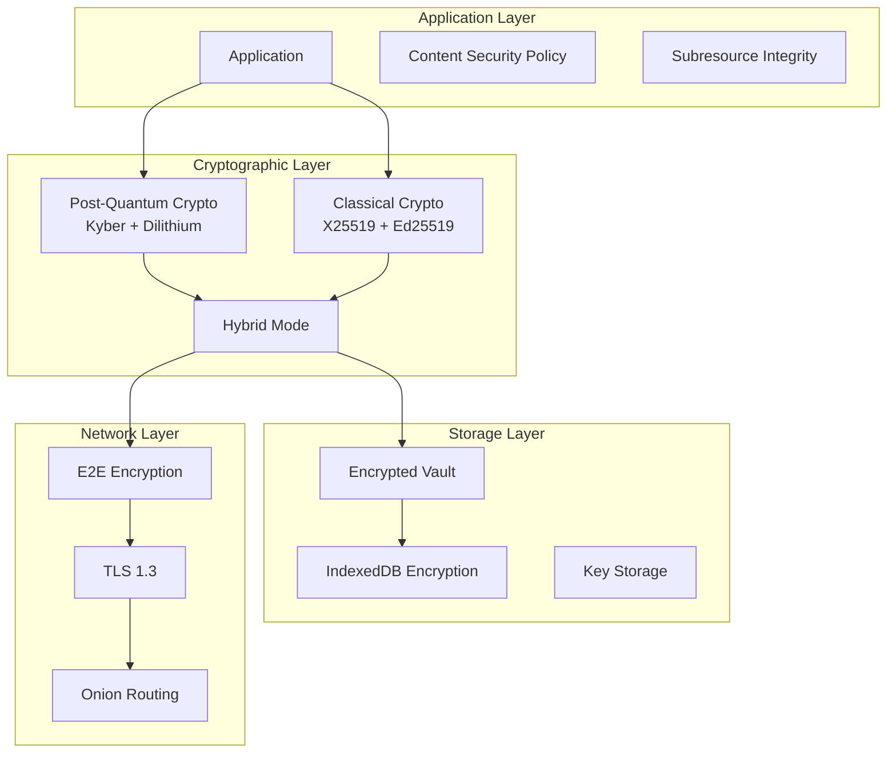

# 🔐 Volli Security Guide

## Executive Summary

Volli is designed as a privacy-first messaging platform with a goal of post-quantum security and local-first operation. This document outlines our security architecture, current implementation status, and roadmap to achieving our security goals.

## Table of Contents
1. [Security Status](#security-status)
2. [Security Principles](#security-principles)
3. [Current Implementation](#current-implementation)
4. [Target Security Architecture](#target-security-architecture)
5. [Threat Model](#threat-model)
6. [Cryptographic Standards](#cryptographic-standards)
7. [Security Best Practices](#security-best-practices)
8. [Vulnerability Disclosure](#vulnerability-disclosure)
9. [Security Roadmap](#security-roadmap)

---

## Security Status

### ⚠️ Development Preview Warning
This is an alpha release intended for development and testing only. Do not use for sensitive communications.

### Current Security Implementation
| Component | Status | Implementation |
|-----------|--------|----------------|
| **Classical Crypto** | ✅ Implemented | X25519, Ed25519, XChaCha20-Poly1305 |
| **Post-Quantum Crypto** | ❌ Placeholder | TODO comments in code |
| **Storage Encryption** | ⚠️ Partial | Package exists, not integrated |
| **E2E Messaging** | ❌ Mock Only | No network layer |
| **Key Management** | ⚠️ Basic | In-memory only |
| **Secure Persistence** | ❌ Missing | Data lost on refresh |

---

## Security Principles

### Core Security Tenets

1. **Zero Trust Architecture**
   - No plaintext data on servers
   - Client-side encryption/decryption only
   - Minimal metadata exposure

2. **Defense in Depth**
   - Multiple encryption layers
   - Fail-secure defaults
   - Principle of least privilege

3. **Privacy by Design**
   - Local-first architecture
   - No telemetry without consent
   - Minimal data collection

4. **Transparency**
   - Open source codebase
   - Documented security architecture
   - Regular security updates

---

## Current Implementation

### What's Actually Secure Now

#### 1. Classical Cryptography (libsodium.js)
```typescript
// Currently implemented in packages
- Key Exchange: X25519
- Signatures: Ed25519  
- Encryption: XChaCha20-Poly1305
- KDF: Argon2id
- Random: crypto.getRandomValues()
```

#### 2. WASM Plugin Sandbox
```typescript
// Implemented security features
- Memory isolation
- CPU time limits
- Capability-based permissions
- Resource quotas
```

### What's NOT Secure Yet

#### 1. No Persistent Encryption
- Web app stores data in memory only
- No IndexedDB encryption implemented
- Vault-core package not integrated

#### 2. No Real Network Security
- Messages don't leave the browser
- No P2P implementation
- No transport encryption

#### 3. Post-Quantum Crypto Missing
```typescript
// Current placeholder code:
// TODO: Replace with actual Kyber-1024 key generation
const kex_pk = new Uint8Array(1568);
const kex_sk = new Uint8Array(3168);
crypto.getRandomValues(kex_pk);
crypto.getRandomValues(kex_sk);
```

---

## Target Security Architecture

### Complete Security Stack (Planned)



### Cryptographic Protocol (Target)

#### Key Hierarchy
```
Master Identity (Hardware-backed when available)
├── Device Identity (PQ + Classical)
│   ├── Kyber-1024 (Key Exchange)
│   ├── Dilithium-3 (Signatures)
│   ├── X25519 (Fallback KEX)
│   └── Ed25519 (Fallback Sig)
├── Session Keys (Ephemeral)
│   ├── Message Keys (per conversation)
│   └── File Keys (per file)
└── Recovery Key (User passphrase)
    └── Argon2id derived
```

#### Message Encryption Flow
```
1. Generate ephemeral Kyber-1024 keypair
2. Encapsulate shared secret with recipient's public key
3. Derive message key using HKDF
4. Encrypt with XChaCha20-Poly1305
5. Sign with Dilithium-3
6. Add forward secrecy ratchet
```

---

## Threat Model

### In-Scope Threats

| Threat | Current Status | Target Mitigation |
|--------|----------------|-------------------|
| **Network Eavesdropping** | ❌ No protection | E2E encryption |
| **MITM Attacks** | ❌ No protection | Public key verification |
| **Server Compromise** | ✅ N/A (no server) | Zero-trust design |
| **Device Theft** | ❌ No protection | Encrypted storage |
| **Quantum Attacks** | ❌ Vulnerable | PQ algorithms |
| **Metadata Analysis** | ⚠️ Partial | Onion routing |
| **Malicious Plugins** | ✅ Sandboxed | WASM isolation |

### Out-of-Scope Threats

1. **Compromised Endpoint**: Malware with system access
2. **Physical Attacks**: Hardware keyloggers, cameras
3. **Supply Chain**: Compromised dependencies
4. **Legal Compulsion**: Lawful access requests
5. **Social Engineering**: User deception

---

## Cryptographic Standards

### Algorithms & Parameters

#### Current Implementation
| Purpose | Algorithm | Parameters | Library |
|---------|-----------|------------|---------|
| KEX | X25519 | RFC 7748 | libsodium.js |
| Sign | Ed25519 | RFC 8032 | libsodium.js |
| Encrypt | XChaCha20-Poly1305 | RFC 8439 ext | libsodium.js |
| KDF | Argon2id | N=65536, r=8, p=1 | libsodium.js |
| Random | CSPRNG | crypto.getRandomValues | Web Crypto |

#### Target Implementation (Research Phase)
| Purpose | Algorithm | NIST Level | Library TBD |
|---------|-----------|------------|-------------|
| KEX | Kyber-1024 | Level 5 | Research pending |
| Sign | Dilithium-3 | Level 3 | Research pending |
| Hybrid | PQ + Classical | N/A | Custom |

### Key Sizes & Lifetimes

```yaml
keys:
  identity:
    classical_size: 32 bytes
    pq_size: 1568 bytes (public)
    lifetime: 1 year
    
  session:
    size: 32 bytes
    lifetime: 1 hour
    rotation: automatic
    
  file:
    size: 32 bytes
    lifetime: until deleted
```

---

## Security Best Practices

### For Developers

#### Secure Coding Standards
```typescript
// ✅ DO: Use constant-time operations
import { timingSafeEqual } from 'crypto';

// ❌ DON'T: Use regular comparison for secrets
if (password === storedPassword) // VULNERABLE

// ✅ DO: Clear sensitive memory
sodium.memzero(privateKey);

// ❌ DON'T: Leave keys in memory
let privateKey = generateKey(); // RISKY

// ✅ DO: Validate all inputs
const validated = schema.parse(userInput);

// ❌ DON'T: Trust user input
eval(userInput); // NEVER
```

#### Security Checklist
- [ ] No sensitive data in logs
- [ ] All inputs validated
- [ ] Crypto operations in constant time
- [ ] Memory cleared after use
- [ ] Dependencies audited
- [ ] Security headers configured
- [ ] CSP policy strict
- [ ] No eval() or innerHTML

### For Users

#### Current Security Limitations
1. **No persistence** - Data lost on refresh
2. **No real encryption** - Only UI mockups
3. **No network security** - Local only
4. **Not audited** - Alpha software

#### Future Security Features
1. Strong passphrase (12+ chars, 128+ bits entropy)
2. Biometric authentication option
3. Hardware key support (WebAuthn)
4. Secure backups with recovery codes

---

## Vulnerability Disclosure

### ⚠️ Not Accepting Reports Yet
As this is early alpha software with known security limitations, we are not accepting vulnerability reports at this time.

### Future Process (When Beta)
1. Dedicated security contact
2. 90-day disclosure timeline
3. CVE assignment for valid issues
4. Security advisory publication

---

## Security Roadmap

### Phase 1: Foundation (Current)
- [x] Basic crypto primitives
- [x] Plugin sandboxing
- [ ] Persistent encrypted storage
- [ ] Real message encryption

### Phase 2: Core Security (Q1 2025)
- [ ] Post-quantum algorithms
- [ ] E2E messaging protocol
- [ ] Key management system
- [ ] Security audit preparation

### Phase 3: Advanced Security (Q2 2025)
- [ ] Hardware key support
- [ ] Formal verification of crypto
- [ ] External security audit
- [ ] Bug bounty program

### Phase 4: Production Ready (Q3 2025)
- [ ] All security features complete
- [ ] Passed security audit
- [ ] Incident response plan
- [ ] Security maintenance process

---

## Appendix: Security Resources

### Standards & References
- [NIST Post-Quantum Cryptography](https://csrc.nist.gov/projects/post-quantum-cryptography)
- [OWASP Application Security](https://owasp.org/www-project-application-security-verification-standard/)
- [RFC 9180 - Hybrid Public Key Encryption](https://www.rfc-editor.org/rfc/rfc9180.html)

### Security Tools
```bash
# Dependency scanning
npm audit
npx snyk test

# Static analysis  
npx eslint --ext .ts,.js,.svelte src/
npx semgrep --config=auto

# Dynamic analysis
npx zap-cli quick-scan http://localhost:3000
```

---

*Last Updated: December 2024*  
*Version: 2.0 - Accurate Security Status*