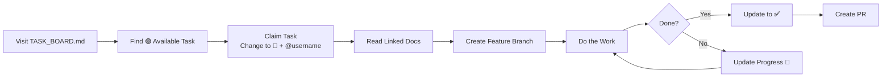

# Volli Task Board - Central Work Tracking

## Contributor Workflow



## How to Use This Board

**New contributor?** Read the full [Contributing Workflow Guide](./CONTRIBUTING_WORKFLOW.md)

**Quick steps:**
1. **Find a task** marked as 🟢 Available
2. **Claim it** by editing this file: Change status to 🔴 and add your GitHub handle
3. **Read the docs** linked in the task
4. **Do the work** following the documentation
5. **Update status** to ✅ when complete or 📝 with progress notes

## Task Status Legend

- 🟢 **Available** - Ready to work on
- 🔴 **In Progress** - Someone is working on this
- ✅ **Complete** - Done and merged
- 🚧 **Blocked** - Waiting on dependencies
- 📝 **Needs Update** - Progress documented below

---

## 🚨 Launch-Critical Tasks (Blocks user adoption)

### Signaling Server
| Task | Status | Owner | Documentation | Notes |
|------|--------|-------|---------------|-------|
| WebSocket signaling server | ✅ Complete | @assistant | [Signaling Plan](./signaling/SIGNALING_DISCOVERY_PHASING_PLAN.md#phase-1-mvp-signaling-weeks-1-3) | TDD implementation complete |
| Client integration | ✅ Complete | @assistant | [Network Store](./P2P_NETWORKING.md#network-store) | SignalingClient integrated |
| Production deployment | 🚧 Blocked | - | [Deployment](./signaling/SIGNALING_DISCOVERY_PHASING_PLAN.md#deployment-strategy) | Needs server first |

### Mobile Apps
| Task | Status | Owner | Documentation | Notes |
|------|--------|-------|---------------|-------|
| Capacitor setup | 🟢 Available | - | [Mobile PWA](./platforms/MULTIPLATFORM_PHASING_PLAN.md#phase-1-mobile-pwa-wrapper-weeks-1-4) | iOS + Android |
| Push notifications | 🚧 Blocked | - | [Native Features](./platforms/MULTIPLATFORM_PHASING_PLAN.md#native-features-phase-1) | Needs signaling |
| App store assets | 🟢 Available | - | [Assets](./platforms/MULTIPLATFORM_PHASING_PLAN.md#week-3-app-store-assets) | Designer needed |

---

## 🎯 Enhancement Tasks (Post-launch improvements)

### Adaptive Trust - Alpha Phase
| Task | Status | Owner | Documentation | Notes |
|------|--------|-------|---------------|-------|
| Rule Engine | ✅ Complete | @assistant | [Implementation Guide](./adaptive-trust/ADAPTIVE_TRUST_IMPLEMENTATION_GUIDE.md#rule-engine--complete) | Merged in PR #1 |
| Network Detector | 🟢 Available | - | [Alpha Scope](./adaptive-trust/ADAPTIVE_TRUST_PHASING_PLAN.md#2-network-detector--essential) | WiFi trust only |
| Trust Manager | 🔴 In Progress | @assistant | [Alpha Scope](./adaptive-trust/ADAPTIVE_TRUST_PHASING_PLAN.md#1-trust-manager--essential) | Basic decision flow |
| Volli Integration | 🚧 Blocked | - | [Integration](./adaptive-trust/ADAPTIVE_TRUST_PHASING_PLAN.md#3-volli-integration--essential) | Needs Trust Manager |

### Desktop Apps
| Task | Status | Owner | Documentation | Notes |
|------|--------|-------|---------------|-------|
| Tauri setup | 🟢 Available | - | [Desktop Phase](./platforms/MULTIPLATFORM_PHASING_PLAN.md#phase-3-desktop-apps-weeks-9-12) | Week 9+ |
| System tray | 🚧 Blocked | - | [Desktop Features](./platforms/MULTIPLATFORM_PHASING_PLAN.md#week-10-desktop-features) | Needs Tauri |

---

## 📋 Task Details

### 🔴 In Progress Tasks

#### WebSocket Signaling Server (COMPLETE)
**Owner**: @assistant  
**Started**: 2025-06-25  
**Progress**:
- ✅ TDD tests written (13 tests covering all functionality)
- ✅ SignalingServer class implementation complete
- ✅ User registration and presence tracking
- ✅ Offer/Answer relay for WebRTC
- ✅ Error handling and connection cleanup
- ✅ All tests passing
- ✅ Build and typecheck successful
- ✅ Committed to branch: `feature/signaling-server`

#### Client Integration (COMPLETE)
**Owner**: @assistant  
**Started**: 2025-06-25  
**Progress**:
- ✅ SignalingClient class with TDD (15 tests)
- ✅ WebSocket connection management with reconnection
- ✅ User registration and discovery
- ✅ Offer/Answer relay handlers
- ✅ NetworkStore integration with signaling
- ✅ Automatic peer discovery before connection
- ✅ All tests passing and builds successful
- ✅ Committed to branch: `feature/signaling-server`

#### Example: Rule Engine (COMPLETE)
**Owner**: @assistant  
**Started**: 2025-01-25  
**Progress**:
- ✅ TDD tests written (17 tests)
- ✅ Implementation complete
- ✅ All tests passing
- ✅ Build successful
- ✅ Committed to branch: `feature/adaptive-trust-rule-engine`

---

### 📝 Progress Updates

#### Task: [Task Name]
**Owner**: @username  
**Update Date**: YYYY-MM-DD  
**Progress**:
- What's complete
- What's remaining
- Any blockers

---

## 🔗 Quick Links

### Documentation
- [Launch Strategy](./LAUNCH_STRATEGY.md) - Overall timeline
- [Phasing Summary](./PHASING_SUMMARY.md) - All features overview
- [Adaptive Trust Guide](./adaptive-trust/ADAPTIVE_TRUST_IMPLEMENTATION_GUIDE.md)
- [P2P Networking](./P2P_NETWORKING.md)

### Coordination
- [Team Chat]: Discord/Slack channel
- [Daily Standup]: Time/link
- [Code Reviews]: PR process

---

## ⚠️ Important Notes

1. **One task at a time** - Don't claim multiple tasks
2. **Update status immediately** - Others are waiting
3. **Ask for help** - Post blockers in team chat
4. **Follow TDD** - Tests first, then implementation
5. **Document progress** - Especially if blocked

## How to Claim a Task

```bash
# 1. Pull latest changes
git pull origin main

# 2. Create your branch
git checkout -b feature/[task-name]

# 3. Edit this file to claim task
# Change: | Task Name | 🟢 Available | - |
# To:     | Task Name | 🔴 In Progress | @yourname |

# 4. Commit and push
git add docs/TASK_BOARD.md
git commit -m "claim: [task name]"
git push origin feature/[task-name]
```

---

*Last Updated: 2025-01-25*