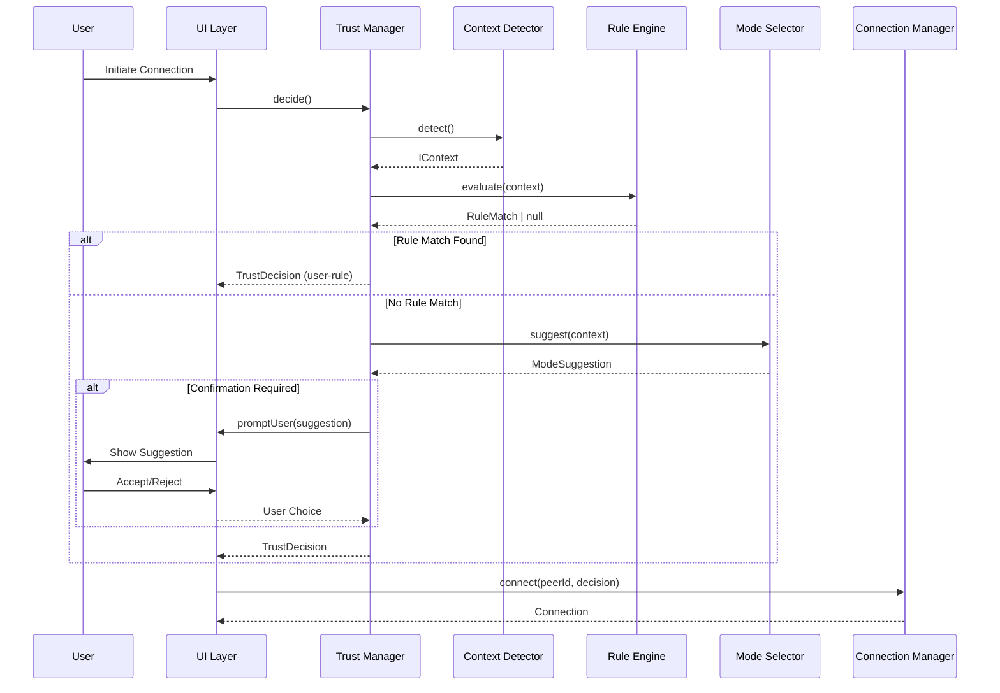
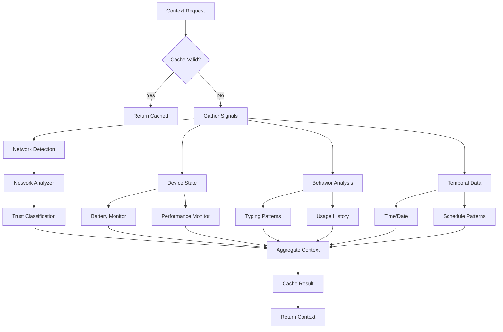
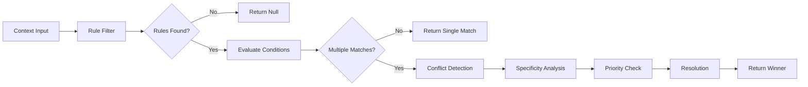

# Adaptive Trust System - Data Flow & State Management

## Overview

This document details how data flows through the Adaptive Trust System and how state is managed across components, ensuring consistency, performance, and reactivity.

## Data Flow Architecture

### High-Level Flow

```
User Action
    │
    ▼
Context Detection ──────► Rule Engine
    │                         │
    │                         ▼
    └────────────────► Mode Selector
                              │
                              ▼
                      Trust Decision
                              │
                              ▼
                    Connection Manager
                              │
                              ▼
                        UI Updates
```

### Detailed Data Flow Diagrams

#### 1. Trust Decision Flow



#### 2. Context Detection Flow



#### 3. Rule Evaluation Flow



## State Management Architecture

### Global State Structure

```typescript
// packages/adaptive-trust/src/state/store.ts

interface GlobalTrustState {
  // Core state
  trust: {
    currentMode: TrustMode;
    currentDecision: TrustDecision | null;
    decisionHistory: CircularBuffer<TrustDecision>;
    modeHistory: ModeChange[];
  };
  
  // Rules state
  rules: {
    items: Map<string, IRule>;
    conflicts: RuleConflict[];
    evaluationCache: LRUCache<string, RuleMatch>;
    lastModified: Date;
  };
  
  // Context state
  context: {
    current: IContext | null;
    history: CircularBuffer<IContext>;
    networkCache: Map<string, NetworkTrust>;
    lastUpdate: Date;
  };
  
  // Connections state
  connections: {
    active: Map<string, ConnectionState>;
    pending: Map<string, PendingConnection>;
    strategies: Map<TrustMode, string[]>;
  };
  
  // UI state
  ui: {
    indicatorVisible: boolean;
    indicatorMode: 'minimal' | 'detailed';
    modeSelectorOpen: boolean;
    ruleBuilderOpen: boolean;
    notifications: Notification[];
    educationDismissed: Set<string>;
  };
  
  // Learning state (ephemeral)
  learning: {
    sessionPatterns: CountMinSketch;
    decisionFeedback: Map<string, Feedback>;
    temporalDecay: number;
  };
  
  // Performance state
  performance: {
    metrics: RingBuffer<PerformanceMetric>;
    batteryProfile: BatteryProfile;
    networkProfile: NetworkProfile;
  };
}
```

### State Management Patterns

#### 1. Store Implementation

```typescript
// Reactive store using Svelte stores or similar
import { writable, derived, get } from 'svelte/store';

class TrustStateStore {
  // Root stores
  private trustState = writable<GlobalTrustState>(initialState);
  
  // Derived stores for specific slices
  public currentMode = derived(
    this.trustState,
    $state => $state.trust.currentMode
  );
  
  public activeRules = derived(
    this.trustState,
    $state => Array.from($state.rules.items.values())
      .filter(rule => rule.enabled)
  );
  
  public connectionCount = derived(
    this.trustState,
    $state => $state.connections.active.size
  );
  
  // Actions
  public updateMode(mode: TrustMode, source: DecisionSource) {
    this.trustState.update(state => ({
      ...state,
      trust: {
        ...state.trust,
        currentMode: mode,
        modeHistory: [
          ...state.trust.modeHistory,
          {
            mode,
            source,
            timestamp: new Date()
          }
        ].slice(-100) // Keep last 100 changes
      }
    }));
    
    // Emit event
    this.eventBus.emit({
      type: 'mode-changed',
      payload: { newMode: mode, source }
    });
  }
  
  // Selectors
  public getState(): GlobalTrustState {
    return get(this.trustState);
  }
  
  public select<T>(selector: (state: GlobalTrustState) => T): T {
    return selector(this.getState());
  }
}
```

#### 2. State Updates Flow

```typescript
// State update patterns for different scenarios

// Pattern 1: Optimistic Updates
async function addRuleOptimistic(rule: RuleInput) {
  // Generate temporary ID
  const tempId = `temp_${Date.now()}`;
  
  // Optimistically update UI
  store.update(state => ({
    ...state,
    rules: {
      ...state.rules,
      items: new Map(state.rules.items).set(tempId, {
        ...rule,
        id: tempId,
        status: 'pending'
      })
    }
  }));
  
  try {
    // Perform actual operation
    const created = await ruleEngine.addRule(rule);
    
    // Replace temp with real
    store.update(state => {
      const items = new Map(state.rules.items);
      items.delete(tempId);
      items.set(created.id, created);
      
      return {
        ...state,
        rules: { ...state.rules, items }
      };
    });
  } catch (error) {
    // Rollback on error
    store.update(state => {
      const items = new Map(state.rules.items);
      items.delete(tempId);
      
      return {
        ...state,
        rules: { ...state.rules, items },
        ui: {
          ...state.ui,
          notifications: [
            ...state.ui.notifications,
            { type: 'error', message: error.message }
          ]
        }
      };
    });
  }
}

// Pattern 2: Transactional Updates
async function switchModeTransactional(
  newMode: TrustMode,
  options: ModeChangeOptions
) {
  const transaction = store.beginTransaction();
  
  try {
    // Update mode
    transaction.update(state => ({
      ...state,
      trust: {
        ...state.trust,
        currentMode: newMode
      }
    }));
    
    // Update connections
    const connections = await connectionManager.updateForMode(newMode);
    transaction.update(state => ({
      ...state,
      connections: {
        ...state.connections,
        active: connections
      }
    }));
    
    // Commit if all succeeds
    await transaction.commit();
  } catch (error) {
    // Automatic rollback
    await transaction.rollback();
    throw error;
  }
}
```

### State Persistence

```typescript
// Selective state persistence
class StatePersistence {
  private readonly STORAGE_KEY = 'volli_trust_state';
  private readonly PERSIST_KEYS = [
    'trust.currentMode',
    'rules.items',
    'context.networkCache',
    'ui.educationDismissed'
  ];
  
  async save(state: GlobalTrustState): Promise<void> {
    const toPersist = this.selectForPersistence(state);
    
    // Encrypt sensitive data
    const encrypted = await this.encrypt(toPersist);
    
    // Store in IndexedDB
    await storage.setItem(this.STORAGE_KEY, encrypted);
  }
  
  async load(): Promise<Partial<GlobalTrustState>> {
    const encrypted = await storage.getItem(this.STORAGE_KEY);
    if (!encrypted) return {};
    
    const decrypted = await this.decrypt(encrypted);
    return this.hydrate(decrypted);
  }
  
  private selectForPersistence(state: GlobalTrustState): any {
    const result = {};
    
    for (const path of this.PERSIST_KEYS) {
      const value = this.getPath(state, path);
      if (value !== undefined) {
        this.setPath(result, path, value);
      }
    }
    
    return result;
  }
}
```

### State Synchronization

```typescript
// Cross-component state sync
class StateSync {
  private channels = new Map<string, BroadcastChannel>();
  
  // Sync between tabs/windows
  setupBroadcastSync() {
    const channel = new BroadcastChannel('trust_state_sync');
    
    channel.onmessage = (event) => {
      if (event.data.type === 'state_update') {
        // Apply remote changes
        store.applyRemoteUpdate(event.data.payload);
      }
    };
    
    // Broadcast local changes
    store.subscribe(state => {
      channel.postMessage({
        type: 'state_update',
        payload: this.getDiff(state)
      });
    });
  }
  
  // Sync with service worker
  setupServiceWorkerSync() {
    navigator.serviceWorker.addEventListener('message', event => {
      if (event.data.type === 'trust_update') {
        store.handleServiceWorkerUpdate(event.data);
      }
    });
  }
}
```

## Data Flow Optimizations

### 1. Caching Strategy

```typescript
class CacheManager {
  private caches = {
    context: new TTLCache<string, IContext>(60000),      // 1 min
    rules: new TTLCache<string, RuleMatch[]>(300000),    // 5 min
    decisions: new LRUCache<string, TrustDecision>(50),  // 50 items
    network: new PersistentCache<string, NetworkTrust>() // Persistent
  };
  
  getCachedDecision(contextId: string): TrustDecision | null {
    return this.caches.decisions.get(contextId);
  }
  
  invalidateOnChange(change: StateChange) {
    if (change.type === 'rule_modified') {
      this.caches.rules.clear();
      this.caches.decisions.clear();
    }
    
    if (change.type === 'network_changed') {
      this.caches.context.clear();
    }
  }
}
```

### 2. Debouncing & Throttling

```typescript
class FlowControl {
  // Debounce context detection
  private debouncedDetect = debounce(
    () => this.contextDetector.detect(),
    1000
  );
  
  // Throttle UI updates
  private throttledUIUpdate = throttle(
    (state) => this.ui.update(state),
    16 // 60fps
  );
  
  // Batch state updates
  private updateQueue: StateUpdate[] = [];
  private flushTimeout: number;
  
  queueUpdate(update: StateUpdate) {
    this.updateQueue.push(update);
    
    clearTimeout(this.flushTimeout);
    this.flushTimeout = setTimeout(() => {
      this.flushUpdates();
    }, 10);
  }
  
  private flushUpdates() {
    const updates = this.updateQueue.splice(0);
    store.batchUpdate(updates);
  }
}
```

### 3. Lazy Loading

```typescript
class LazyDataLoader {
  // Load rules on demand
  async getRulesLazy(): Promise<IRule[]> {
    if (!this.rulesLoaded) {
      const rules = await storage.getRules();
      store.update(state => ({
        ...state,
        rules: { ...state.rules, items: rules }
      }));
      this.rulesLoaded = true;
    }
    
    return store.select(state => 
      Array.from(state.rules.items.values())
    );
  }
  
  // Load history on demand
  async getHistoryLazy(offset: number, limit: number) {
    const history = await storage.getDecisionHistory(offset, limit);
    
    store.update(state => ({
      ...state,
      trust: {
        ...state.trust,
        decisionHistory: history
      }
    }));
    
    return history;
  }
}
```

## Event Flow

### Event Propagation

```typescript
class EventFlow {
  private eventBus = new EventEmitter();
  private eventQueue: QueuedEvent[] = [];
  private processing = false;
  
  // Event flow diagram:
  // Component → Event Bus → Store → Side Effects → UI Updates
  
  async emit(event: TrustEvent) {
    // Queue event
    this.eventQueue.push({
      event,
      timestamp: Date.now(),
      id: generateId()
    });
    
    // Process queue
    if (!this.processing) {
      await this.processEventQueue();
    }
  }
  
  private async processEventQueue() {
    this.processing = true;
    
    while (this.eventQueue.length > 0) {
      const { event } = this.eventQueue.shift()!;
      
      try {
        // Update store
        await this.updateStore(event);
        
        // Run side effects
        await this.runSideEffects(event);
        
        // Notify subscribers
        this.eventBus.emit(event.type, event);
        
        // Update UI
        this.updateUI(event);
      } catch (error) {
        console.error('Event processing error:', error);
        this.handleEventError(event, error);
      }
    }
    
    this.processing = false;
  }
}
```

## Performance Monitoring

```typescript
class DataFlowMonitor {
  private metrics = new RingBuffer<FlowMetric>(1000);
  
  measureFlow<T>(
    operation: string,
    fn: () => Promise<T>
  ): Promise<T> {
    const start = performance.now();
    const startMemory = performance.memory?.usedJSHeapSize;
    
    return fn().finally(() => {
      const duration = performance.now() - start;
      const memoryDelta = startMemory 
        ? performance.memory.usedJSHeapSize - startMemory
        : 0;
      
      this.metrics.add({
        operation,
        duration,
        memoryDelta,
        timestamp: Date.now()
      });
    });
  }
  
  getReport(): FlowReport {
    const operations = new Map<string, OperationStats>();
    
    for (const metric of this.metrics.toArray()) {
      const stats = operations.get(metric.operation) || {
        count: 0,
        totalDuration: 0,
        maxDuration: 0,
        avgMemoryDelta: 0
      };
      
      stats.count++;
      stats.totalDuration += metric.duration;
      stats.maxDuration = Math.max(stats.maxDuration, metric.duration);
      stats.avgMemoryDelta = 
        (stats.avgMemoryDelta * (stats.count - 1) + metric.memoryDelta) 
        / stats.count;
      
      operations.set(metric.operation, stats);
    }
    
    return { operations, totalMetrics: this.metrics.length };
  }
}
```

## Data Flow Best Practices

1. **Unidirectional Flow**: Data flows down, events flow up
2. **Immutable Updates**: Never mutate state directly
3. **Lazy Evaluation**: Load data only when needed
4. **Optimistic Updates**: Update UI immediately, reconcile later
5. **Error Boundaries**: Catch and handle errors at each layer
6. **Performance Budgets**: Monitor and enforce limits

## Testing Data Flow

```typescript
describe('Data Flow', () => {
  it('should flow from context to decision', async () => {
    const harness = createTestHarness();
    
    // Set context
    await harness.setContext({
      network: { trust: 'public' }
    });
    
    // Trigger decision
    const decision = await harness.trustManager.decide();
    
    // Verify flow
    expect(decision.context.network.trust).toBe('public');
    expect(harness.getEvents()).toContainEqual(
      expect.objectContaining({
        type: 'context-detected'
      })
    );
  });
});
```