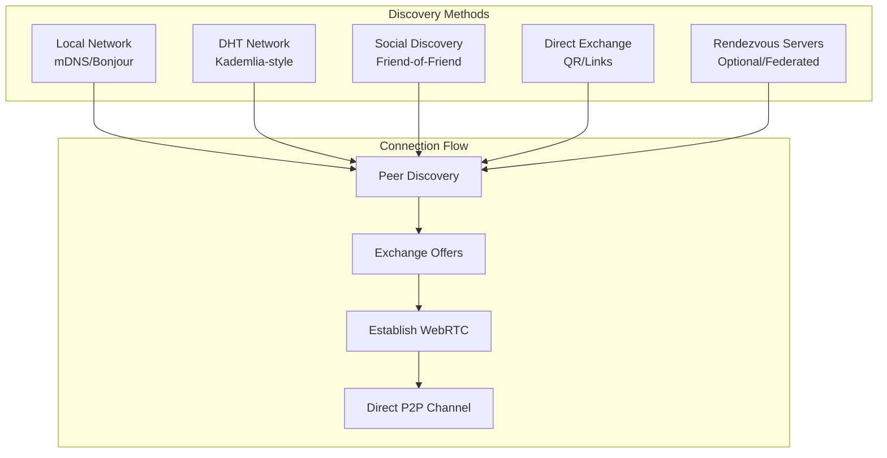

# Decentralized Signaling Architecture for Volli

## The Challenge

Signal's centralized signaling server provides:
1. **User Discovery**: Find contacts by phone number
2. **Presence**: Know when peers are online
3. **NAT Traversal**: Help peers connect through firewalls
4. **Message Queue**: Store messages for offline users
5. **Push Notifications**: Alert mobile devices

The cost: Complete dependency on Signal's infrastructure, making it a single point of failure and surveillance.

## Volli's Hybrid Approach: Best of All Worlds

### Core Principle: Progressive Decentralization
Start with what works, provide escape hatches, gradually move toward full decentralization.

## Architecture Overview



## Implementation Strategy

### Phase 1: Multiple Discovery Methods (No Single Point of Failure)

#### 1. Direct Exchange (Always Works)
```javascript
// Generate connection link
const invite = {
  peerId: myPeerId,
  publicKey: myPublicKey,
  endpoints: [
    'stun:stun.l.google.com:19302',
    'turn:turn.volli.io:3478' // Optional
  ],
  timestamp: Date.now()
};
const link = `volli://connect/${base64(invite)}`;
```

**Sharing Methods:**
- QR Code display/scan
- Copy/paste link
- NFC tap
- Airdrop/Nearby Share

#### 2. Local Network Discovery (Zero Infrastructure)
```javascript
// mDNS/Bonjour for same network
const mdns = new MDNSDiscovery({
  service: '_volli._tcp',
  txt: {
    id: peerId,
    pk: publicKey,
    v: version
  }
});

// Automatic discovery on same WiFi/LAN
mdns.on('peer', (peer) => {
  attemptConnection(peer);
});
```

#### 3. DHT-Based Discovery (Truly Decentralized)
```javascript
// Join global DHT network
const dht = new KademliaeDHT({
  bootstrapNodes: [
    // Community-run nodes
    'dht.volli.community:6881',
    'dht.privacy.tools:6881',
    // User can add their own
  ],
  id: sha256(publicKey)
});

// Publish presence
dht.announce(myPeerId, {
  endpoints: myEndpoints,
  capabilities: ['webrtc', 'v1']
});

// Find peers
dht.findPeer(contactPublicKey);
```

#### 4. Social Graph Discovery (Trust-Based)
```javascript
// Discover through mutual contacts
const socialDiscovery = {
  // Alice knows Bob and Charlie
  // Bob wants to connect to Charlie
  // Alice can facilitate introduction
  
  introducePeers(peer1, peer2) {
    // Send encrypted introduction to both
    const intro1 = encrypt(peer2.info, peer1.publicKey);
    const intro2 = encrypt(peer1.info, peer2.publicKey);
    
    sendToPeer(peer1, { type: 'introduction', data: intro1 });
    sendToPeer(peer2, { type: 'introduction', data: intro2 });
  }
};
```

### Phase 2: Optional Infrastructure (User Choice)

#### Federated Rendezvous Servers
```javascript
// Users can choose or run their own
const rendezvousServers = [
  // Default community servers
  'wss://signal.volli.community',
  'wss://signal.privacy.tools',
  
  // Corporate/Organization servers
  'wss://signal.mycompany.com',
  
  // Self-hosted
  'wss://my-raspberry-pi.local:8080',
  
  // Tor hidden service
  'wss://voll123...onion'
];

// Minimal protocol - just exchange offers
class RendezvousClient {
  async register(peerId, offer) {
    // Server only sees encrypted peer ID and offer
    // Cannot decrypt or MITM connections
  }
  
  async retrieve(peerId) {
    // Get pending offers for this peer
  }
}
```

#### Rendezvous Server Features:
- **Minimal**: Only forwards encrypted connection offers
- **Ephemeral**: No message storage, only connection setup
- **Federated**: Anyone can run one
- **Optional**: Other methods work without it
- **Privacy**: Can't see message content or metadata

### Phase 3: Advanced Techniques

#### 1. Blockchain/ENS Integration
```javascript
// Publish on Ethereum Name Service
'alice.volli.eth' -> {
  publicKey: '0x...',
  endpoints: ['dht://...', 'wss://...']
}
```

#### 2. IPFS Integration
```javascript
// Use IPFS pubsub for discovery
ipfs.pubsub.subscribe('volli-announce', (msg) => {
  const peer = JSON.parse(msg.data);
  discoveredPeers.add(peer);
});
```

#### 3. Steganographic Channels
```javascript
// Hide connection info in:
// - Social media posts (Twitter bio, GitHub gists)
// - DNS TXT records
// - Bitcoin OP_RETURN
// - Image EXIF data
```

## Message Queue Without Centralization

### Problem: What if recipient is offline?

#### Solution 1: Friend Relay
```javascript
// Mutual friends can relay messages
class FriendRelay {
  async relayMessage(message, recipient) {
    const mutualFriends = findMutualFriends(recipient);
    
    for (const friend of mutualFriends) {
      if (friend.online && friend.trusts(me)) {
        // Encrypt message for recipient
        const encrypted = encryptForRecipient(message, recipient);
        
        // Ask friend to hold it
        await friend.store({
          for: recipient.id,
          encrypted: encrypted,
          until: Date.now() + 7 * 24 * 60 * 60 * 1000 // 7 days
        });
      }
    }
  }
}
```

#### Solution 2: Distributed Storage
```javascript
// Store encrypted messages in DHT
class DHTMessageQueue {
  async queueMessage(recipientId, encryptedMessage) {
    // Split message into shares
    const shares = secretShare(encryptedMessage, 3, 5); // 3 of 5
    
    // Store across DHT nodes
    for (let i = 0; i < shares.length; i++) {
      const nodeId = hash(recipientId + i);
      await dht.store(nodeId, shares[i]);
    }
  }
}
```

#### Solution 3: Time-Based Rendezvous
```javascript
// Both parties check at predetermined times
class TimeBasedSync {
  getNextSyncTime(peerId) {
    // Deterministic but unpredictable
    const shared = hash(myId + peerId);
    const hour = shared[0] % 24;
    const minute = shared[1] % 60;
    
    return nextOccurrence(hour, minute);
  }
}
```

## Implementation Priorities

### Must Have (Phase 2.1)
1. Direct link/QR code exchange
2. mDNS local discovery  
3. Basic DHT implementation
4. Friend relay for offline messages

### Should Have (Phase 2.2)
1. Federated rendezvous servers
2. Social graph discovery
3. Multi-method failover
4. Distributed message queue

### Nice to Have (Phase 2.3)
1. Blockchain integration
2. IPFS discovery
3. Steganographic channels
4. Advanced privacy features

## Privacy Considerations

### What's Hidden
- Message content (end-to-end encrypted)
- Social graph (unless explicitly shared)
- Online presence (optional disclosure)
- Connection times (with time-based sync)

### What's Visible
- Participation in network (if using DHT)
- Public key (acts as identity)
- General availability (if announced)

### User Controls
```javascript
const privacySettings = {
  // Discovery preferences
  discovery: {
    allowDHT: true,
    allowMDNS: true,
    allowRendezvous: false,
    requireIntroduction: true
  },
  
  // Presence settings
  presence: {
    showOnline: 'contacts', // 'all', 'contacts', 'none'
    acceptUnknown: false,
    requireProofOfWork: true
  },
  
  // Relay preferences  
  relay: {
    actAsRelay: true,
    maxMessages: 100,
    maxStorage: '100MB',
    trustedRelays: ['alice', 'bob']
  }
};
```

## Comparison with Signal

| Feature | Signal | Volli |
|---------|--------|-------|
| User Discovery | Phone number + central server | Multiple methods (QR, DHT, social) |
| Online Presence | Central server tracking | Optional P2P announcement |
| Message Queue | Central server storage | Friend relay / DHT storage |
| NAT Traversal | Central TURN servers | P2P hole punching + optional TURN |
| Metadata | Minimal but centralized | Distributed across network |
| Availability | Requires Signal servers | Multiple fallback methods |
| Setup Complexity | Phone number only | Flexible (simple to advanced) |

## Next Steps

1. **Research**: Evaluate DHT libraries (libp2p, webtorrent)
2. **Prototype**: Build QR code exchange first
3. **Test**: Local network discovery with mDNS
4. **Implement**: Basic DHT with fallback
5. **Optimize**: Performance and battery usage
6. **Document**: User guides for each method

## Conclusion

Volli's approach provides multiple paths to connection:
- **Simple**: QR codes for grandma
- **Automatic**: Local network discovery
- **Resilient**: DHT for activists  
- **Private**: Friend introductions
- **Flexible**: Optional infrastructure

No single point of failure. No mandatory phone numbers. No central surveillance point. Just peers finding peers, the way the internet was meant to work.