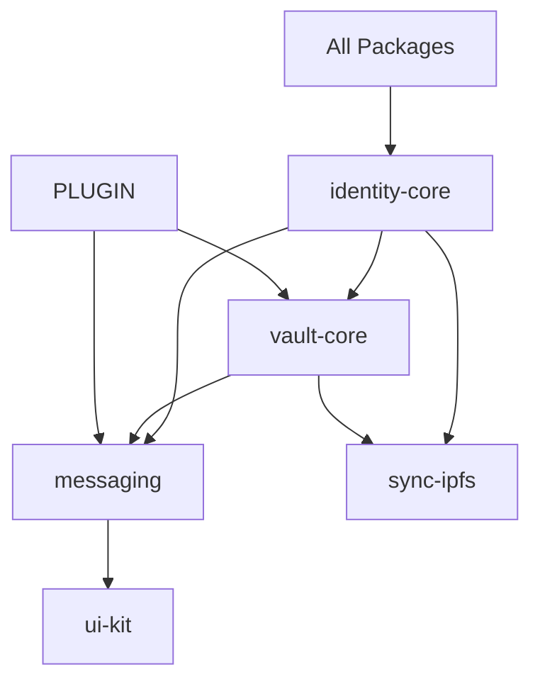

# Phase 1: Volli Package Requirements and Specifications

## Overview

This document defines detailed requirements for the missing Volli packages, with emphasis on post-quantum security, API contracts, and dependency relationships.

## 1. Identity Core (`@volli/identity-core`)

### Missing Files Requirements

#### 1.1 `identity.ts`
**Purpose**: Core identity management and lifecycle operations

**Functional Requirements**:
- Generate post-quantum secure identities using Kyber-1024 and Dilithium-3
- Maintain hybrid mode with X25519/Ed25519 for backward compatibility
- Support multi-device identity linking
- Implement identity recovery mechanisms
- Handle identity metadata management

**Security Requirements**:
- Secure key generation using system CSPRNG
- Zero-knowledge proof of identity ownership
- Side-channel resistant implementations
- Secure memory handling for private keys

**API Contract**:
```typescript
interface IdentityManager {
  generateIdentity(params?: IdentityParams): Promise<Identity>
  importIdentity(backup: EncryptedBackup, passphrase: string): Promise<Identity>
  exportIdentity(identity: Identity, passphrase: string): Promise<EncryptedBackup>
  linkDevice(identity: Identity, deviceKey: DeviceKey): Promise<Identity>
  revokeDevice(identity: Identity, deviceId: string): Promise<Identity>
  updateMetadata(identity: Identity, metadata: IdentityMetadata): Promise<Identity>
}
```

#### 1.2 `keys.ts`
**Purpose**: Cryptographic key generation, derivation, and management

**Functional Requirements**:
- Generate Kyber-1024 key pairs for key encapsulation
- Generate Dilithium-3 key pairs for signatures
- Derive session keys using KDF (Argon2id)
- Support key rotation and revocation
- Implement secure key storage patterns

**Security Requirements**:
- FIPS 203 compliant Kyber implementation
- FIPS 204 compliant Dilithium implementation
- Constant-time operations for all key operations
- Secure erasure of key material from memory

**API Contract**:
```typescript
interface KeyManager {
  generateKeyPair(algorithm: 'kyber' | 'dilithium' | 'x25519' | 'ed25519'): Promise<KeyPair>
  deriveSessionKey(sharedSecret: Uint8Array, info: Uint8Array): SessionKey
  encapsulate(publicKey: PublicKey): Promise<{ ciphertext: Uint8Array; sharedSecret: Uint8Array }>
  decapsulate(privateKey: PrivateKey, ciphertext: Uint8Array): Promise<Uint8Array>
  sign(privateKey: PrivateKey, message: Uint8Array): Promise<Uint8Array>
  verify(publicKey: PublicKey, message: Uint8Array, signature: Uint8Array): Promise<boolean>
}
```

#### 1.3 `pairing.ts`
**Purpose**: Device pairing and trust establishment

**Functional Requirements**:
- Generate secure pairing QR codes with embedded public keys
- Implement PIN-based verification for pairing
- Support proximity-based pairing (NFC/Bluetooth optional)
- Handle pairing session lifecycle
- Implement trust level management

**Security Requirements**:
- Time-limited pairing sessions (5 minutes)
- Rate limiting on PIN attempts
- Perfect forward secrecy for pairing
- Protection against MITM attacks

**API Contract**:
```typescript
interface PairingManager {
  initiatePairing(identity: Identity): Promise<PairingData>
  completePairing(pairingData: PairingData, pin: string): Promise<DeviceKey>
  verifyPairing(localIdentity: Identity, remoteKey: PublicKey): Promise<TrustLevel>
  generatePairingQR(pairingData: PairingData): Promise<string>
  parsePairingQR(qrCode: string): Promise<PairingData>
}
```

#### 1.4 `crypto.ts`
**Purpose**: Low-level cryptographic operations and utilities

**Functional Requirements**:
- Wrapper for liboqs and libsodium operations
- Implement hybrid encryption schemes
- Provide secure random number generation
- Handle key serialization/deserialization
- Implement cryptographic primitives

**Security Requirements**:
- Use validated cryptographic libraries only
- Implement defense against timing attacks
- Secure memory allocation and cleanup
- Cryptographic agility for algorithm migration

**API Contract**:
```typescript
interface CryptoOperations {
  randomBytes(size: number): Uint8Array
  hash(data: Uint8Array, algorithm?: 'sha256' | 'sha512' | 'blake2b'): Uint8Array
  encrypt(plaintext: Uint8Array, key: Uint8Array, nonce?: Uint8Array): EncryptedData
  decrypt(ciphertext: EncryptedData, key: Uint8Array): Uint8Array
  deriveKey(password: string, salt: Uint8Array, params: KeyDerivationParams): Uint8Array
  constantTimeCompare(a: Uint8Array, b: Uint8Array): boolean
}
```

### Dependencies
- `libsodium-wrappers`: Traditional cryptography
- `liboqs-js`: Post-quantum algorithms (to be integrated)
- `qrcode`: QR code generation
- `uuid`: Unique identifier generation

## 2. Vault Core (`@volli/vault-core`)

### Functional Requirements
- Encrypted local storage using SQLite and IndexedDB
- CRDT-based conflict resolution with Automerge 2
- Full-text encrypted search with FlexSearch
- Backup and restore capabilities
- Storage quota management

### Security Requirements
- All data encrypted at rest with XChaCha20-Poly1305
- Key derivation from user passphrase using Argon2id
- Metadata encryption to prevent information leakage
- Secure deletion of old data
- Protection against rollback attacks

### API Contract
```typescript
interface VaultCore {
  // Storage operations
  open(passphrase: string): Promise<Vault>
  close(): Promise<void>
  changePassphrase(oldPass: string, newPass: string): Promise<void>
  
  // Data operations
  store(collection: string, id: string, data: any): Promise<void>
  retrieve(collection: string, id: string): Promise<any>
  query(collection: string, predicate: QueryPredicate): Promise<any[]>
  delete(collection: string, id: string): Promise<void>
  
  // Sync operations
  generateDiff(since: Timestamp): Promise<CRDTDiff>
  applyDiff(diff: CRDTDiff): Promise<void>
  
  // Search operations
  index(collection: string, document: any): Promise<void>
  search(query: string, options?: SearchOptions): Promise<SearchResult[]>
  
  // Backup operations
  backup(destination: BackupDestination): Promise<BackupHandle>
  restore(source: BackupHandle): Promise<void>
}
```

### Dependencies
- `sql.js`: SQLite in browser
- `automerge`: CRDT engine
- `flexsearch`: Encrypted search
- `idb`: IndexedDB wrapper

## 3. Messaging (`@volli/messaging`)

### Functional Requirements
- Message composition and parsing
- Thread management and organization
- File attachment handling
- Message encryption/decryption
- Delivery receipt management
- Message schema validation

### Security Requirements
- End-to-end encryption for all messages
- Forward secrecy with double ratchet algorithm
- Message authentication codes
- Replay attack prevention
- Metadata minimization

### API Contract
```typescript
interface MessagingCore {
  // Message operations
  composeMessage(content: MessageContent, recipients: Identity[]): Promise<Message>
  encryptMessage(message: Message, sessionKey: SessionKey): Promise<EncryptedMessage>
  decryptMessage(encrypted: EncryptedMessage, sessionKey: SessionKey): Promise<Message>
  
  // Thread operations
  createThread(participants: Identity[], metadata?: ThreadMetadata): Promise<Thread>
  addToThread(threadId: string, message: Message): Promise<void>
  getThreadMessages(threadId: string, pagination?: Pagination): Promise<Message[]>
  
  // File handling
  attachFile(message: Message, file: File): Promise<Message>
  encryptFile(file: File, key: Uint8Array): Promise<EncryptedFile>
  decryptFile(encrypted: EncryptedFile, key: Uint8Array): Promise<File>
  
  // Schema validation
  validateMessage(message: any): message is Message
  validateThread(thread: any): thread is Thread
}
```

### Dependencies
- `@volli/identity-core`: Identity management
- `@volli/vault-core`: Storage layer
- `zod`: Schema validation

## 4. IPFS Sync (`@volli/sync-ipfs`)

### Functional Requirements
- IPFS node initialization and management
- Content-addressed storage for encrypted data
- Peer discovery and connection management
- HTTPS relay fallback mechanism
- Bandwidth optimization

### Security Requirements
- All data encrypted before IPFS storage
- Peer authentication using identity keys
- Protection against sybil attacks
- Rate limiting and quota enforcement
- Network traffic obfuscation

### API Contract
```typescript
interface IPFSSync {
  // Node management
  initialize(config: IPFSConfig): Promise<void>
  start(): Promise<void>
  stop(): Promise<void>
  
  // Data operations
  publish(data: Uint8Array, metadata?: PublishMetadata): Promise<CID>
  retrieve(cid: CID): Promise<Uint8Array>
  pin(cid: CID): Promise<void>
  unpin(cid: CID): Promise<void>
  
  // Sync operations
  subscribe(topic: string, handler: MessageHandler): Promise<Subscription>
  broadcast(topic: string, message: Uint8Array): Promise<void>
  
  // Relay fallback
  useRelay(relayUrl: string): Promise<void>
  syncViaRelay(peerId: string, data: Uint8Array): Promise<void>
}
```

### Dependencies
- `ipfs-core`: IPFS implementation
- `libp2p`: Networking layer
- `@volli/vault-core`: Local storage

## 5. UI Kit (`@volli/ui-kit`)

### Functional Requirements
- Reusable Svelte components
- Accessibility compliance (WCAG 2.1 AA)
- Theme system with dark mode
- Responsive design patterns
- Animation and transition system

### Security Requirements
- XSS prevention in all components
- Content Security Policy compliance
- Safe HTML rendering
- Input validation and sanitization

### API Contract
```typescript
interface UIKit {
  // Core components
  Button: SvelteComponent
  Input: SvelteComponent
  MessageBubble: SvelteComponent
  ThreadList: SvelteComponent
  ContactCard: SvelteComponent
  
  // Composite components
  MessageComposer: SvelteComponent
  ThreadView: SvelteComponent
  SettingsPanel: SvelteComponent
  
  // Utilities
  theme: ThemeSystem
  icons: IconSet
  animations: AnimationPresets
}
```

### Dependencies
- `svelte`: Component framework
- `tailwindcss`: Styling system
- `@floating-ui/dom`: Positioning engine

## 6. Plugin System (`@volli/plugins`)

### Functional Requirements
- WASM module loading and execution
- Permission management system
- Resource sandboxing
- Plugin lifecycle management
- Inter-plugin communication

### Security Requirements
- Capability-based security model
- Memory isolation between plugins
- CPU and memory quotas
- Audit logging of all operations
- Plugin signature verification

### API Contract
```typescript
interface PluginRuntime {
  // Plugin management
  loadPlugin(wasmModule: ArrayBuffer, manifest: PluginManifest): Promise<Plugin>
  unloadPlugin(pluginId: string): Promise<void>
  
  // Execution
  executePlugin(pluginId: string, method: string, args: any[]): Promise<any>
  
  // Permissions
  checkPermission(pluginId: string, capability: Capability): boolean
  grantPermission(pluginId: string, capability: Capability): Promise<void>
  revokePermission(pluginId: string, capability: Capability): Promise<void>
  
  // Communication
  sendMessage(from: string, to: string, message: any): Promise<void>
  subscribe(pluginId: string, event: string, handler: EventHandler): Subscription
}
```

### Dependencies
- `@wasmer/wasi`: WASM runtime
- `comlink`: Worker communication

## Integration Requirements

### Package Interdependencies


### Build Requirements
- TypeScript 5.0+ with strict mode
- ESM and CommonJS dual builds
- Tree-shaking support
- Source maps for debugging
- Type declaration files

### Testing Requirements
- Unit test coverage > 90%
- Integration tests for package interactions
- Security-focused test cases
- Performance benchmarks
- Cross-platform compatibility tests

## Performance Requirements

### Latency Targets
- Identity generation: < 100ms
- Message encryption: < 50ms
- Vault query: < 20ms
- UI interactions: < 16ms (60 FPS)

### Resource Constraints
- Memory usage: < 100MB baseline
- Storage growth: < 1MB/1000 messages
- Network bandwidth: Adaptive to connection
- Battery efficiency for mobile

## Migration Strategy

### Version Compatibility
- Semantic versioning for all packages
- Breaking change migration guides
- Deprecation warnings
- Data format versioning

### Post-Quantum Timeline
- 2024-2025: Hybrid mode (PQ + traditional)
- 2026: PQ-first with traditional fallback
- 2027: PQ-only mode
- 2028+: Remove traditional crypto

## Compliance Requirements

### Standards
- FIPS 203/204/205 for PQ crypto
- WCAG 2.1 AA for accessibility
- GDPR for data privacy
- SOC 2 Type II readiness

### Documentation
- API documentation with examples
- Security architecture documentation
- Plugin development guide
- Operations runbook